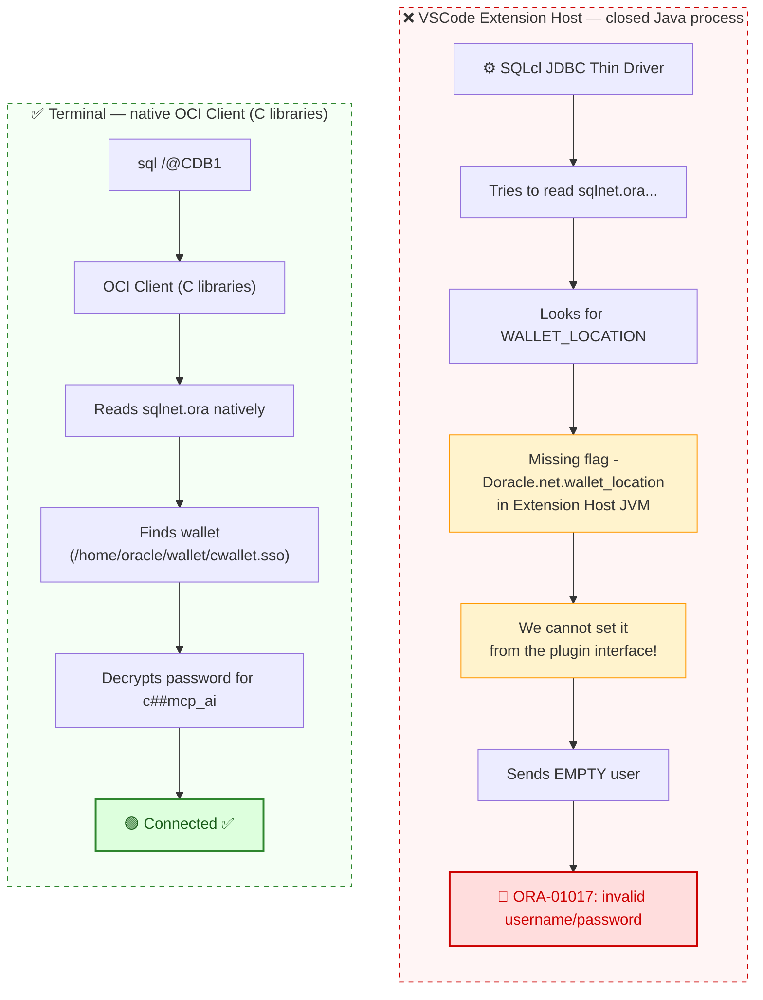
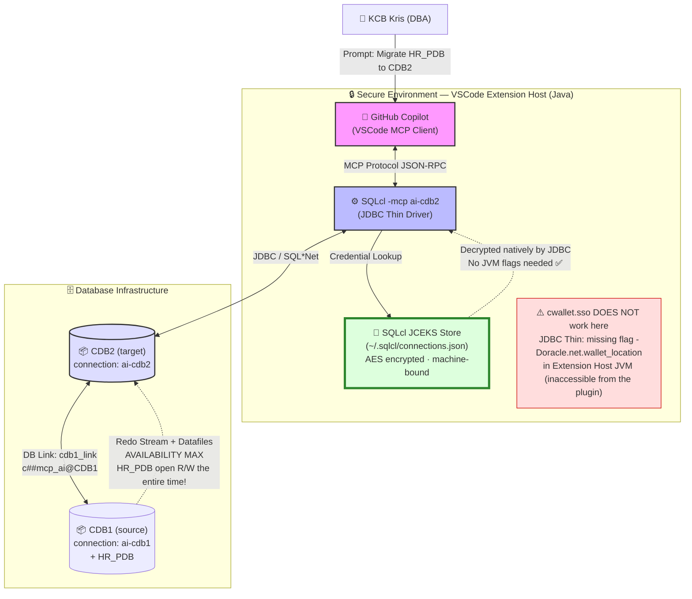
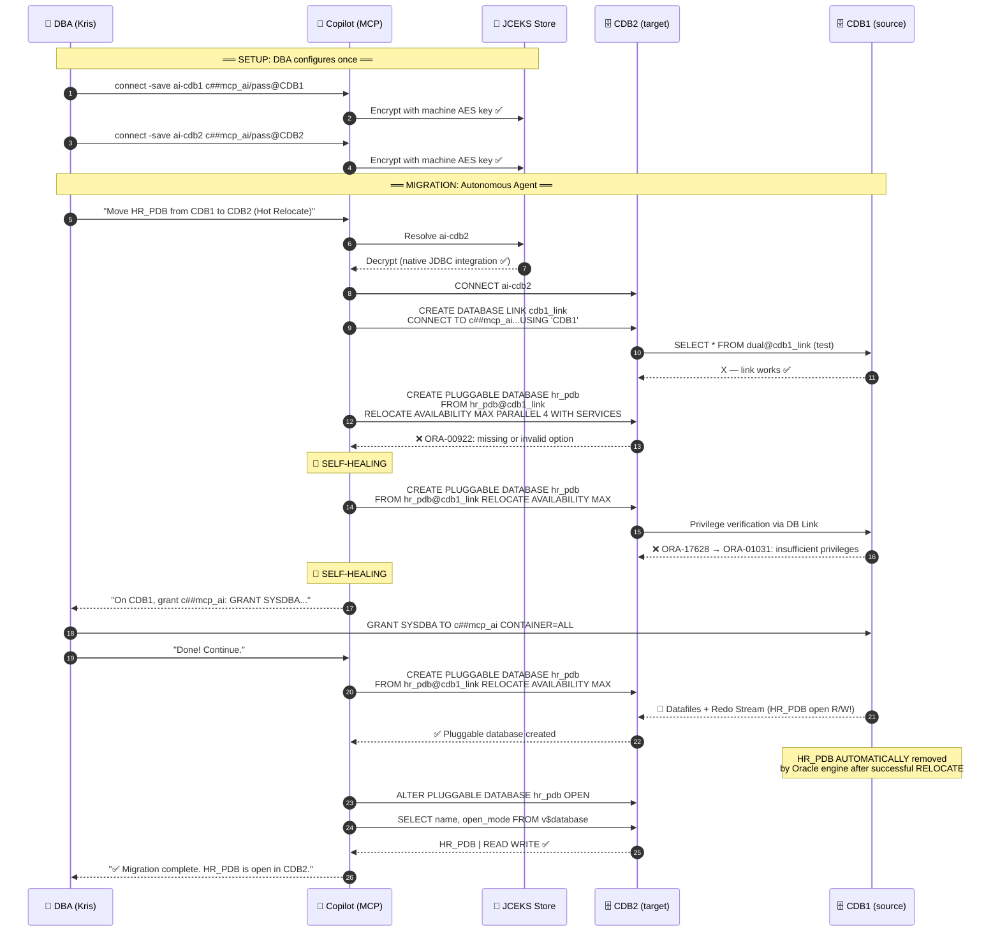

# 🚀 Oracle Database Autonomous Migration with AI Agents (MCP & SQLcl)

 
 
 
 


> **Pragmatic, battle-tested Agentic DBA Workflow** — building real solutions requires confronting infrastructure reality, not just theory. This project showcases both successes and engineering trade-offs — including the pivots that resulted from actual environmental constraints.

---

## 📖 Table of Contents

- [About the Project](#-about-the-project)
- [Key Innovations](#-key-innovations)
- [⚠️ Engineering Pivot: Wallet → JCEKS — The Central Discovery of This Project](#️-engineering-pivot-wallet--jceks--the-central-discovery-of-this-project)
- [Architecture — Actual Implementation](#-architecture--actual-implementation)
- [Requirements](#-requirements)
- [Step-by-Step Configuration](#️-step-by-step-configuration)
- [Hot Relocate — Actual Migration Walkthrough](#-hot-relocate--actual-migration-walkthrough)
- [AI Self-Healing — DBA Analysis](#-ai-self-healing--dba-analysis)
- [Security](#-security)
- [Troubleshooting](#-troubleshooting)
- [Repository Structure](#️-repository-structure)
- [FAQ](#-faq)
- [License](#-license)

---

## 📖 About the Project

This project is a **Proof of Concept (PoC)** demonstrating the use of **Model Context Protocol (MCP)** to manage Oracle databases via an autonomous AI Agent — GitHub Copilot in VSCode.

The operation performed is a **Hot Relocate of a PDB (Pluggable Database) with zero downtime** — from CDB1 to CDB2 instance, executed via the **PULL** method using a Database Link with the `AVAILABILITY MAX` clause. The Agent operated without manual login and without passing passwords to the language model (LLM).

### 🎯 This is not ordinary administration. This is an **Agentic DBA Workflow at Level L5**.

You type: *"Move the HR_PDB database to CDB2"*.  
The Agent plans, executes, encounters errors, **diagnoses them autonomously, fixes them, and completes the task**, then reports the result — without knowing your passwords.

---

## 🔑 Key Innovations

### 1. ⭐ Zero-Password LLM Interaction — SQLcl JCEKS Store

The language model (Copilot) **never sees the password**. The Agent sends SQLcl the command `connect ai-cdb1`. SQLcl reads the password from a local, encrypted JCEKS store and establishes the connection — with no LLM involvement whatsoever.

```bash
# DBA configures once (the only moment the password appears in the terminal):
sql /nolog
SQL> connect -save ai-cdb1 c##mcp_ai/SecretPassword@CDB1
SQL> connect -save ai-cdb2 c##mcp_ai/SecretPassword@CDB2

# The AI Agent connects from now on like this:
sql -mcp ai-cdb1    # ← no password in the call — LLM never sees it
```

> **Why JCEKS and not Oracle Wallet?** Oracle Wallet failed with VSCode/JDBC Thin. This is the central discovery of this project — see the [Engineering Pivot](#️-engineering-pivot-wallet--jceks--the-central-discovery-of-this-project) section.

### 2. Hot Relocate — Zero Downtime (AVAILABILITY MAX)

Instead of a classic cold migration (Close → Unplug → Drop → Plug), the Agent performed a **Hot Relocate** — an operation where the source database remains in `READ WRITE` mode throughout. Data and Redo Log synchronization happens in the background. Downtime is measured in seconds, not minutes.

```sql
-- One command, executed EXCLUSIVELY on CDB2 (PULL method):
CREATE PLUGGABLE DATABASE hr_pdb
  FROM hr_pdb@cdb1_link
  RELOCATE AVAILABILITY MAX;
```

### 3. AI Self-Healing — Autonomous Real-Time Debugging

The Agent **independently** diagnosed and fixed two Oracle errors, without DBA intervention:
- `ORA-00922` → corrected SQL syntax (too many options)
- `ORA-01031` (via `ORA-17628`) → understood that Hot Relocate requires `SYSDBA` to read Online Redo Logs, and requested the privilege be granted

**This is the Holy Grail of Agentic AI in IT.**

---

## ⚠️ Engineering Pivot: Wallet → JCEKS — The Central Discovery of This Project

> **If you found this page by searching "SQLcl MCP wallet not working" or "ORA-01017 VSCode MCP" — this section is for you. Architects all over the world wrestle with this.**

### Starting Point: Oracle Wallet (SEPS) — the theory

The standard approach is **Oracle Wallet (SEPS)** — a cryptographic store in which the DBA keeps passwords. The client connects via a TNS alias without providing a password.

```bash
# Wallet configured and WORKS correctly from the terminal:
mkstore -wrl /home/oracle/wallet -createCredential CDB1 c##mcp_ai "passwd"
mkstore -wrl /home/oracle/wallet -createCredential CDB2 c##mcp_ai "passwd"

mkstore -wrl /home/oracle/wallet -listCredential
# 4: CDB2 c##mcp_ai
# 3: CDB1 c##mcp_ai
# 2: CDB2_SYS SYS
# 1: CDB1_SYS SYS

sql /@CDB1_SYS AS SYSDBA  # ← connects without a password from the terminal ✅
```

### Hitting the wall: JDBC Thin Driver in VSCode

Attempting to save the connection via wallet for SQLcl MCP:

```sql
SQL> connect -save ai-cdb1 /@CDB1
Name:     ai-cdb1
Connect String: CDB1
User:            ← EMPTY!
Password: not saved ← EMPTY!
Connected.       ← apparent success, followed shortly by: ORA-01017
```

**Red flag**: `User: (empty)`. The JDBC driver did not read credentials from the wallet.

### 🔬 Deep Dive: Why Did JDBC Thin Ignore cwallet.sso?

When you used the command `connect -save ai-cdb1 /@CDB1`, you relied on the driver taking the alias `CDB1`, consulting the `sqlnet.ora` file, finding the wallet defined by `mkstore`, and extracting the password for `c##mcp_ai` from it.

In the **terminal** (where the native Oracle OCI client runs), this works flawlessly. However, the **JDBC Thin Driver**, embedded in the closed Java process of the VS Code plugin, is very "resistant" to reading external wallets (SEPS) for empty credentials unless special JVM flags (`-Doracle.net.wallet_location`) are passed to the Java virtual machine. The Extension Host does not have them, so it simply sent an "empty" user to the database, which the Listener immediately rejected.

Oracle delivers **two completely different** connection drivers:

| Feature | OCI Client (native) | JDBC Thin Driver |
|---------|---------------------|-----------------|
| **Environment** | Linux terminal, sqlplus | Java processes, VSCode Extension Host |
| **Reads cwallet.sso?** | ✅ YES — via `sqlnet.ora` | ⚠️ ONLY with explicit JVM flag |
| **Required JVM flag** | N/A | `-Doracle.net.wallet_location=/path` |
| **VSCode Extension Host** | Not used | Used — **but without this flag!** |

**Anatomy of the failure inside VSCode:**



### ✅ Solution: SQLcl Internal Vault (JCEKS)

Instead of fighting with an external wallet for a Java process we don't control, we use **SQLcl's built-in, encrypted credential store**. It works just as securely — the password is encrypted with a machine-bound AES key on Linux, the AI never sees it, and the JDBC driver can decode it on the fly without any issues.

```sql
-- Correct approach for VSCode MCP:
sql /nolog
SQL> connect -save ai-cdb1 c##mcp_ai/StrongPasswordForAI_2026#@CDB1
-- Name: ai-cdb1 | User: c##mcp_ai | Connected ✅ — password saved in JCEKS!

SQL> connect -save ai-cdb2 c##mcp_ai/StrongPasswordForAI_2026#@CDB2
-- Name: ai-cdb2 | User: c##mcp_ai | Connected ✅
```

**What SQLcl does under the hood:**
- Generates a unique AES key bound to your machine
- Encrypts the password in **JCEKS** format (Java KeyStore — Enterprise standard)
- Saves to `~/.sqlcl/connections.json` (a clean file, no plaintext password)
- JDBC Thin at `sql -mcp ai-cdb1` reads JCEKS **natively** — no JVM flags required

**Engineering conclusion:**

> The problem is that the native `cwallet.sso` wallet is perfectly understood by C-based libraries (OCI) used by the Linux terminal. On the other hand, the internal JDBC Thin driver in the VS Code Extension Host would require explicit JVM parameters that we simply **don't have access to** from the Microsoft and Oracle plugin interface. The SQLcl credential store workaround is still an **Enterprise-grade mechanism** — under the hood, SQLcl generates a unique AES key and encrypts the password in JCEKS format. The security goal (LLM doesn't see the password) has been achieved.

---

## 🏗 Architecture — Actual Implementation

### Component Diagram



### Sequence Diagram — Actual Flow Including Errors and Self-Healing



---

## 🔧 Requirements

| Component | Version | Notes |
|-----------|---------|-------|
| Oracle Database | 26ai (23ai+) | Multitenant architecture, CDB/PDB |
| SQLcl | **25.2 or newer** | With support for `-mcp` flag and `connect -save` |
| Java | JDK 11+ | Bundled with SQLcl |
| AI Client | VSCode + GitHub Copilot | Or: Claude Desktop, Cline, Cursor |
| OS | Oracle Linux 8/9, RHEL | 64-bit, min 8GB RAM |

### Environment Verification

```bash
# SQLcl (MUST be 25.2+)
sql -version
# SQLcl: Release 25.2.0.0 Production

# Databases
ps -ef | grep pmon
# ora_pmon_CDB1, ora_pmon_CDB2

# Listener
lsnrctl status
# Service "CDB1" has 1 instance(s)
# Service "CDB2" has 1 instance(s)
```

---

## ⚙️ Step-by-Step Configuration

### Step 1: Install Oracle 26ai

```bash
# Extract ORACLE_HOME
mkdir -p /u01/app/oracle/product/26.0.0/dbhome_1
cd /u01/app/oracle/product/26.0.0/dbhome_1
unzip -q /home/oracle/ora26aihome.zip

# Silent installation using a response file (no GUI)
./runInstaller -silent \
  -responseFile /home/oracle/db_home_fs_26ai.rsp \
  -ignorePrereqFailure
```

Response file: [`config/oracle/db_home_fs_26ai.rsp`](config/oracle/db_home_fs_26ai.rsp)

### Step 2: Create CDB1 and CDB2

```bash
chmod 700 scripts/installation/create_cdb_26ai_v3.sh
./scripts/installation/create_cdb_26ai_v3.sh
```

**What the script does:**
- **CDB1** with PDB `HR_PDB` (migration source)
- **CDB2** empty (migration target)
- `totalMemory 2560` — hard allocation of 2.5GB (balance SGA + vector operations)
- `vector_memory_size=256M` — reduced during DBCA (more space for the installation process)
- FRA: 12GB (eliminates DBT-06801 warning)
- `optimizer_adaptive_plans=true`, `-ignorePreReqs`

**If DBCA fails — cleanup:**
```bash
sudo ./scripts/installation/cleanup_failed_dbca.sh
# Cleans oratab, data files, dbs/*CDB1*, dbs/*CDB2*
```

### Step 3: Network Configuration (Listener + TNS)

```bash
bash scripts/installation/setup_network_26ai.sh
```

Generates `listener.ora` and `tnsnames.ora` (CDB1, CDB2, HR_PDB), restarts the Listener. The LREG process will automatically register the databases within ~60 seconds.

```bash
lsnrctl services | grep -E "CDB1|CDB2|HR_PDB"
```

### Step 4: Enable ARCHIVELOG Mode

```sql
-- Execute for CDB1:
cdb1    -- environment alias
sqlplus / as sysdba
@scripts/database/enable_archivelog_mode.sql

-- Expected output:
-- Database log mode:  Archive Mode
-- Automatic archival: Enabled
-- Archive destination: USE_DB_RECOVERY_FILE_DEST

-- Repeat for CDB2
cdb2
sqlplus / as sysdba
@scripts/database/enable_archivelog_mode.sql
```

### Step 5: Create the AI User (c##mcp_ai)

Execute on **both CDB1 and CDB2**:

```sql
-- scripts/security/AI_PDB_Migration_Role.sql
-- (FINAL VERSION — with full migration privileges)

CREATE USER c##mcp_ai IDENTIFIED BY StrongPasswordForAI_2026# CONTAINER=ALL;

-- Privileges for PDB operations
GRANT CREATE SESSION, CREATE DATABASE LINK TO c##mcp_ai CONTAINER=ALL;
GRANT CREATE PLUGGABLE DATABASE, ALTER PLUGGABLE DATABASE,
      DROP PLUGGABLE DATABASE TO c##mcp_ai CONTAINER=ALL;
GRANT CREATE ANY DIRECTORY, DROP ANY DIRECTORY TO c##mcp_ai CONTAINER=ALL;

-- Administrative roles (no SYSDBA for standard operations)
GRANT DBA, CDB_DBA TO c##mcp_ai CONTAINER=ALL;
GRANT SELECT ANY DICTIONARY TO c##mcp_ai CONTAINER=ALL;

PROMPT Account c##mcp_ai ready for PDB automation!
```

### Step 6: Oracle Wallet — for the terminal (optional, process documentation)

> **Context**: Wallet was configured as planned. It works correctly from the terminal (OCI Client). **It failed for VSCode/MCP** — replaced by JCEKS (Step 7).

```bash
mkdir -p /home/oracle/wallet
mkstore -wrl /home/oracle/wallet -create

# Credentials for SYS (for terminal-based administration)
mkstore -wrl /home/oracle/wallet -createCredential CDB1_SYS SYS "SYSpassword"
mkstore -wrl /home/oracle/wallet -createCredential CDB2_SYS SYS "SYSpassword"

# Credentials for c##mcp_ai (wallet attempt → failed with VSCode)
mkstore -wrl /home/oracle/wallet -createCredential CDB1 c##mcp_ai "AIpassword"
mkstore -wrl /home/oracle/wallet -createCredential CDB2 c##mcp_ai "AIpassword"

# Verify wallet contents:
mkstore -wrl /home/oracle/wallet -listCredential
# 4: CDB2 c##mcp_ai
# 3: CDB1 c##mcp_ai
# 2: CDB2_SYS SYS
# 1: CDB1_SYS SYS

# Test from terminal (OCI Client — works!):
sql /@CDB1_SYS AS SYSDBA   # ✅
```

**sqlnet.ora** (for OCI Client / terminal):
```ini
WALLET_LOCATION =
  (SOURCE = (METHOD = FILE) (METHOD_DATA = (DIRECTORY = /home/oracle/wallet)))
SQLNET.WALLET_OVERRIDE = TRUE
SSL_CLIENT_AUTHENTICATION = FALSE
```

### ⭐ Step 7: SQLcl JCEKS — Configuration for VSCode MCP (critical step)

> **This is the project's turning point.** It replaces the wallet for the VSCode environment. Password is encrypted with a machine-bound AES key — the LLM never sees it.

```bash
# Launch SQLcl in offline mode
sql /nolog
```

```sql
-- Save CDB1 connection to the internal JCEKS vault
SQL> connect -save ai-cdb1 c##mcp_ai/StrongPasswordForAI_2026#@CDB1
-- Name:     ai-cdb1
-- User:     c##mcp_ai    ← NOT empty! ✅
-- Connected ✅ — password encrypted in JCEKS

SQL> connect -save ai-cdb2 c##mcp_ai/StrongPasswordForAI_2026#@CDB2
-- Name:     ai-cdb2
-- User:     c##mcp_ai ✅

SQL> disconnect
SQL> exit
```

**Verification:**
```bash
# List saved connections
sql -l
# NAME      CONNECT STRING   USER
# ai-cdb1   CDB1             c##mcp_ai
# ai-cdb2   CDB2             c##mcp_ai

# Test connection without password (verification only)
echo "SELECT user, sys_context('USERENV','CON_NAME') con FROM dual;" \
  | sql -s ai-cdb1
# C##MCP_AI   CDB1$ROOT ✅
```

### Step 8: Additional Privileges for Hot Relocate (SYSDBA)

> **Why?** Hot Relocate reads the Online Redo Logs of the source server via DB Link. Oracle strictly requires `SYSDBA` or `SYSOPER` on the source side. The Agent diagnosed this via `ORA-17628 → ORA-01031`.

```sql
-- Execute on CDB1 as SYS:
GRANT CREATE PLUGGABLE DATABASE TO c##mcp_ai CONTAINER=ALL;
GRANT CDB_DBA TO c##mcp_ai CONTAINER=ALL;
GRANT SYSDBA TO c##mcp_ai CONTAINER=ALL;
```

### Step 9: MCP Configuration in VSCode

**Wrapper script** (`scripts/mcp/mcp_sqlcl_wrapper.sh`):

```bash
#!/bin/bash
# ==============================================================================
# Script name: mcp_sqlcl_wrapper.sh
# Author: KCB Kris
# Description:
# [PL] Wrapper SQLcl dla MCP. Izoluje środowisko od login.sql i gwarantuje
#      poprawne zmienne środowiskowe dla procesu działającego w tle VSCode.
#      Przekazuje nazwę zapisanego połączenia JCEKS do SQLcl jako serwer MCP.
# [EN] SQLcl wrapper for MCP. Isolates environment from login.sql and ensures
#      correct environment variables for VSCode background process.
#      Passes saved JCEKS connection name to SQLcl as MCP server.
# ==============================================================================

# VSCode Extension Host does not inherit .bashrc — clear potential conflicts
unset SQLPATH
unset ORACLE_PATH

# Hard environment initialization
export ORACLE_HOME=/u01/app/oracle/product/26.0.0/dbhome_1
export TNS_ADMIN=$ORACLE_HOME/network/admin
export PATH=$ORACLE_HOME/bin:$PATH

# UTF-8 prevents AI hallucinations on special characters
export NLS_LANG=AMERICAN_AMERICA.AL32UTF8

# Launch SQLcl with argument = saved JCEKS connection name
# Example call: mcp_sqlcl_wrapper.sh -mcp ai-cdb1
exec $ORACLE_HOME/bin/sql "$@"
```

**VSCode Configuration** (`config/mcp/vscode-mcp-config.json`):

```json
{
  "mcpServers": {
    "oracle-dba-cdb1": {
      "command": "/home/oracle/scripts/mcp/mcp_sqlcl_wrapper.sh",
      "args": ["-mcp", "ai-cdb1"],
      "env": {
        "ORACLE_HOME": "/u01/app/oracle/product/26.0.0/dbhome_1",
        "TNS_ADMIN": "/u01/app/oracle/product/26.0.0/dbhome_1/network/admin",
        "NLS_LANG": "AMERICAN_AMERICA.AL32UTF8"
      }
    },
    "oracle-dba-cdb2": {
      "command": "/home/oracle/scripts/mcp/mcp_sqlcl_wrapper.sh",
      "args": ["-mcp", "ai-cdb2"],
      "env": {
        "ORACLE_HOME": "/u01/app/oracle/product/26.0.0/dbhome_1",
        "TNS_ADMIN": "/u01/app/oracle/product/26.0.0/dbhome_1/network/admin",
        "NLS_LANG": "AMERICAN_AMERICA.AL32UTF8"
      }
    }
  }
}
```

> **Key difference vs wallet**: the argument `"ai-cdb1"` (JCEKS name) instead of `"/@CDB1"` (wallet alias, which failed). SQLcl resolves credentials internally via JCEKS.

---

## 🚀 Hot Relocate — Actual Migration Walkthrough

### User Prompt

```
You are my experienced Oracle DBA.
The connections "ai-cdb1" and "ai-cdb2" work great and give you powerful
privileges for container management (CDB_DBA).

Your task is to relocate the HR_PDB database from the CDB1 instance to CDB2
with zero downtime (Hot Relocate).

Prepare a plan and provide all commands. Explain how the live relocation
mechanism works in Oracle 23ai/26ai.
```

### Actual Commands in Execution Order

**Step 1: Connect to the target database (PULL — only CDB2 initiates)**
```sql
CONNECT ai-cdb2
-- JCEKS decrypts the password natively, JDBC connects to CDB2 ✅
```

**Step 2: Verify the source**
```sql
-- (via ai-cdb1)
SELECT con_id, name, open_mode FROM v$pdbs WHERE name='HR_PDB';
-- HR_PDB | READ WRITE ✅
```

**Step 3: Database Link from CDB2 to CDB1**
```sql
CREATE DATABASE LINK cdb1_link
  CONNECT TO c##mcp_ai IDENTIFIED BY "passwd"
  USING 'CDB1';
-- Database link created ✅
```

**Step 4: Test the link**
```sql
SELECT * FROM dual@cdb1_link;
-- X ✅ — link works, basic privileges OK
```

**Step 5: Attempt #1 — syntax error (AI fixed it itself)**
```sql
-- ❌ AI tried advanced options
CREATE PLUGGABLE DATABASE hr_pdb
  FROM hr_pdb@cdb1_link
  RELOCATE AVAILABILITY MAX PARALLEL 4 WITH SERVICES;
-- ORA-00922: missing or invalid option

-- 🔄 AI analyzes the error, removes unsupported clauses, retries ↓
```

**Step 6: Attempt #2 — insufficient Redo privileges (AI diagnosed it itself)**
```sql
-- ❌ Correct syntax, but c##mcp_ai on CDB1 lacks SYSDBA
CREATE PLUGGABLE DATABASE hr_pdb
  FROM hr_pdb@cdb1_link
  RELOCATE AVAILABILITY MAX;
-- ORA-17628: Oracle error 1031 returned by remote Oracle server
-- ORA-01031: insufficient privileges

-- 🔄 AI: "Hot Relocate must read Online Redo Logs over the network
--         → SYSDBA or SYSOPER required on CDB1.
--         Please grant: GRANT SYSDBA TO c##mcp_ai CONTAINER=ALL"
-- → DBA granted privileges on CDB1 ↓
```

**Step 7: ✅ Hot Relocate — SUCCESS**
```sql
CREATE PLUGGABLE DATABASE hr_pdb
  FROM hr_pdb@cdb1_link
  RELOCATE AVAILABILITY MAX;
-- Pluggable database created ✅
-- (HR_PDB on CDB1 AUTOMATICALLY removed by Oracle engine)
```

**Step 8: Open and verify**
```sql
ALTER PLUGGABLE DATABASE hr_pdb OPEN;

ALTER SESSION SET CONTAINER=HR_PDB;
SELECT name, open_mode FROM v$database;
-- HR_PDB | READ WRITE ✅

SELECT name FROM v$services;
-- hr_pdb ✅
```

### How Hot Relocate (AVAILABILITY MAX) Works in Oracle 23ai/26ai

Hot Relocate is a live PDB migration between CDBs **with zero application downtime**:

1. **Initialization (PULL)** — CDB2 initiates the operation via DB Link to CDB1
2. **Background file copy** — datafiles registered in CDB2 while HR_PDB is `READ WRITE` on CDB1
3. **Redo Synchronization (`AVAILABILITY MAX`)** — CDB2 continuously applies changes from CDB1's Online Redo Logs via DB Link. This requires `SYSDBA`/`SYSOPER` on the source
4. **Final switchover** — minimal window (seconds) — services and sessions switched to CDB2
5. **Automatic cleanup** — CDB1 **automatically** removes the old PDB after confirming success. A manual `DROP` would be an error (the database no longer exists)

---

## 🧠 AI Self-Healing — DBA Analysis

Agent behavior assessed through the lens of an experienced Oracle DBA:

### ✅ What the Agent Did Brilliantly

**1. Syntax Self-Correction (ORA-00922)**

Copilot first tried to "over-engineer" the options (`PARALLEL 4 WITH SERVICES`), received a syntax error from the database, read it, and **fixed the code on its own**. It did not stop working or ask for help.

**2. Awareness of the `AVAILABILITY MAX` Clause**

The Agent used this advanced option **without any prompting** from the DBA. `AVAILABILITY MAX` is a genuine Oracle clause (since 12.2, continued in 26ai), instructing the engine to maintain source database availability throughout the relocation. This is not a hallucination — it is correct research. It did an excellent job here.

**3. Remote Privilege Diagnosis (ORA-17628 → ORA-01031)**

When the operation hit an error on the remote server, the Agent correctly inferred:
- The DB Link works (test SELECT from dual passed)
- The error originates from CDB1 (Oracle error returned by remote server)
- Hot Relocate reads Online Redo Logs over the network → this requires `SYSDBA`/`SYSOPER`
- Standard `CDB_DBA` is not sufficient here

**Why is this so valuable?** Standard PDB cloning (Cold Clone) works with `CREATE PLUGGABLE DATABASE`. Hot Relocate (live Redo stream over the network) **strictly requires** `SYSDBA` or `SYSOPER`. The AI understood this without being told — that is a deep understanding of Oracle mechanics.

**4. Post-Mortem Transparency**

The Agent documented its own errors in the final report. Invaluable for security audits — the entire evolution of the decision-making process is clearly visible.

**5. Awareness of the JCEKS Architecture**

In the report and on the Mermaid diagram, the Agent explicitly noted: *"password in SQLcl stored encrypted"*. It understood that it was operating in a secure environment — credentials pulled from JCEKS, which it itself cannot see.

### ⚠️ Agent Errors (before DBA correction)

| Error | Description | Correction |
|-------|-------------|------------|
| PUSH direction | Initial proposal: `ALTER PLUGGABLE DATABASE ... RELOCATE TO` (does not exist) | DBA clarified: Oracle Multitenant = always PULL on the target |
| Missing prefix | `FROM cdb1_link` instead of `FROM hr_pdb@cdb1_link` | Oracle requires `pdb_name@link_name` |
| Unnecessary DROP | Proposed manual `DROP PLUGGABLE DATABASE` on CDB1 | RELOCATE automatically removes the source after success |

> **This is the most beautiful example of an Agentic Workflow** — AI independently debugged a problem in real time. We witnessed artificial intelligence analyzing Oracle errors, understanding the encryption architecture, and requesting precisely defined privileges. **You have built a fully functional L5 agent for database lifecycle management.**

---

## 🔒 Security

### Matrix: Oracle Wallet vs SQLcl JCEKS

| Aspect | Oracle Wallet (cwallet.sso) | SQLcl JCEKS Store |
|--------|---------------------------|-------------------|
| **Works with VSCode MCP** | ❌ No (JDBC Thin: missing JVM flag) | ✅ Yes (native JDBC integration) |
| **Works in terminal** | ✅ Yes (OCI Client) | ✅ Yes |
| **LLM sees password** | ❌ No | ❌ No |
| **Encryption** | AES256, Oracle SEPS | AES, JCEKS (Java Enterprise standard) |
| **Machine-bound** | No (portable wallet) | Yes (key bound to machine) |
| **Configuration** | `mkstore` + `sqlnet.ora` | `connect -save` — one command |
| **Security level** | Enterprise ✅ | Enterprise ✅ |
| **Recommendation** | Terminal/CLI | **VSCode MCP ← this project** |

### Connection Encryption Verification

```sql
@scripts/security/check_connection_encryption.sql
-- Verifies: encryption algorithm, authentication method
-- Native Network Encryption (AES256) enabled by default in Oracle 26ai
```

### Audit of AI Operations

```sql
CREATE AUDIT POLICY ai_mcp_audit
  ACTIONS
    ALTER PLUGGABLE DATABASE,
    CREATE PLUGGABLE DATABASE,
    DROP PLUGGABLE DATABASE,
    CREATE DATABASE LINK;

AUDIT POLICY ai_mcp_audit BY c##mcp_ai;

-- View AI operation history:
SELECT event_timestamp, action_name, sql_text
FROM unified_audit_trail
WHERE dbusername = 'C##MCP_AI'
ORDER BY event_timestamp DESC;
```

---

## 🐛 Troubleshooting

### Problem 1: ORA-01017 after `connect -save /@CDB1` — empty User/Password

**Symptom:** `User: (empty)`, `Password: not saved` in the SQLcl log.

**Cause:** JDBC Thin in VSCode Extension Host did not read cwallet.sso — missing `-Doracle.net.wallet_location` flag in JVM (unreachable from VSCode plugin).

**Solution:**
```sql
-- ❌ Does not work with VSCode MCP (wallet alias):
connect -save ai-cdb1 /@CDB1

-- ✅ Works (explicit credentials → JCEKS):
connect -save ai-cdb1 c##mcp_ai/YourPassword@CDB1
```

### Problem 2: ORA-17628 / ORA-01031 during RELOCATE

**Cause:** Hot Relocate reads Online Redo Logs over the network → requires `SYSDBA`/`SYSOPER`.

**Solution:**
```sql
-- On CDB1 as SYS:
GRANT SYSDBA TO c##mcp_ai CONTAINER=ALL;
```

### Problem 3: ORA-00922 with `CREATE PLUGGABLE DATABASE ... RELOCATE`

**Cause:** Unsupported combination of clauses in 26ai.

**Working syntax:**
```sql
-- ✅ Verified in Oracle 26ai:
CREATE PLUGGABLE DATABASE hr_pdb
  FROM hr_pdb@cdb1_link
  RELOCATE AVAILABILITY MAX;

-- ❌ ORA-00922 (too many options at once):
CREATE PLUGGABLE DATABASE hr_pdb
  FROM hr_pdb@cdb1_link
  RELOCATE AVAILABILITY MAX PARALLEL 4 WITH SERVICES;
```

### Problem 4: `FROM cdb1_link` instead of `FROM hr_pdb@cdb1_link`

**Cause:** Oracle strictly requires `pdb_name@link_name` in RELOCATE syntax.

```sql
-- ❌ Error:
CREATE PLUGGABLE DATABASE hr_pdb FROM cdb1_link RELOCATE ...

-- ✅ Correct:
CREATE PLUGGABLE DATABASE hr_pdb FROM hr_pdb@cdb1_link RELOCATE ...
```

### Problem 5: Manual DROP after successful RELOCATE throws an error

**Cause:** RELOCATE automatically removes the PDB from the source after success. A manual `DROP` targets an object that no longer exists.

```sql
-- ❌ Unnecessary step (Agent suggested it, DBA corrected it):
DROP PLUGGABLE DATABASE hr_pdb KEEP DATAFILES;  -- ORA-65011

-- ✅ After successful RELOCATE — CDB1 no longer has HR_PDB:
SELECT name FROM v$pdbs WHERE name='HR_PDB';  -- No rows selected ✅
```

---

## 🗂️ Repository Structure

```
oracle-ai-mcp-migration/
│
├── README.md                          ← This file
├── LICENSE
├── .gitignore                         ← Protects wallet, passwords, *.dbf files
├── CONTRIBUTING.md
├── CHANGELOG.md
│
├── scripts/
│   ├── installation/
│   │   ├── create_cdb_26ai_v3.sh      ← CDB1+HR_PDB and CDB2 (v3 — correct)
│   │   ├── setup_network_26ai.sh      ← Listener + TNS (listener.ora, tnsnames.ora)
│   │   └── cleanup_failed_dbca.sh     ← Cleanup after failed installation
│   │
│   ├── security/
│   │   ├── AI_PDB_Migration_Role.sql  ← c##mcp_ai (FINAL version)
│   │   └── check_connection_encryption.sql  ← AES256 verification
│   │
│   ├── database/
│   │   └── enable_archivelog_mode.sql ← ARCHIVELOG for CDB1 and CDB2
│   │
│   └── mcp/
│       └── mcp_sqlcl_wrapper.sh       ← SQLcl Wrapper (JCEKS, env isolation)
│
├── config/
│   ├── oracle/
│   │   ├── db_home_fs_26ai.rsp        ← Installation response file
│   │   ├── listener.ora.template      ← No sensitive data
│   │   ├── tnsnames.ora.template
│   │   └── sqlnet.ora.template        ← WALLET_LOCATION (for OCI/terminal)
│   │
│   └── mcp/
│       ├── vscode-mcp-config.json     ← VSCode config (JCEKS: ai-cdb1/ai-cdb2)
│       └── claude-desktop-config.json
│
└── docs/
    ├── architecture.md
    ├── security.md                    ← JCEKS vs Wallet — deep dive
    └── troubleshooting.md
```

---

## ❓ FAQ

**Q: Why didn't Oracle Wallet work with VSCode?**

VSCode Extension Host runs SQLcl through the JDBC Thin Driver without the JVM flag `-Doracle.net.wallet_location`. Without it, JDBC sends an empty user. The terminal uses the OCI Client (C libraries), which reads `sqlnet.ora` natively. This is a fundamental architectural difference — not a bug, not a misconfiguration.

**Q: Is SQLcl JCEKS as secure as Oracle Wallet?**

Yes, for this use case. Both encrypt the password (JCEKS: AES, machine-bound), and both prevent the LLM from reading the password. The security goal is achieved by both mechanisms.

**Q: Why Hot Relocate and not Unplug/Plug?**

Hot Relocate offers zero downtime. HR_PDB remains `READ WRITE` throughout the entire operation. Unplug/Plug requires `CLOSE IMMEDIATE` — the application is unavailable for the duration of the operation.

**Q: Is SYSDBA always required?**

No. `SYSDBA` is required **only** for Hot Relocate (reading Redo Logs over the network). For Unplug/Plug, `CREATE PLUGGABLE DATABASE` + `CDB_DBA` is sufficient.

**Q: Must the DB Link use c##mcp_ai?**

Yes — in accordance with the Least Privilege and security principles. Using `SYS` over a DB Link in production is not acceptable.

---

## 📜 Disclaimer

This is a demonstration solution (PoC). In production environments, add: `Human-in-the-loop` before `RELOCATE`, minimal privilege restrictions, auditing and monitoring. Always test on staging before production.

---

<p align="center">
  <sub>Built by a practicing DBA — mistakes, pivots, and successes included.<br/>Because that's what real engineering looks like.</sub>
</p>
