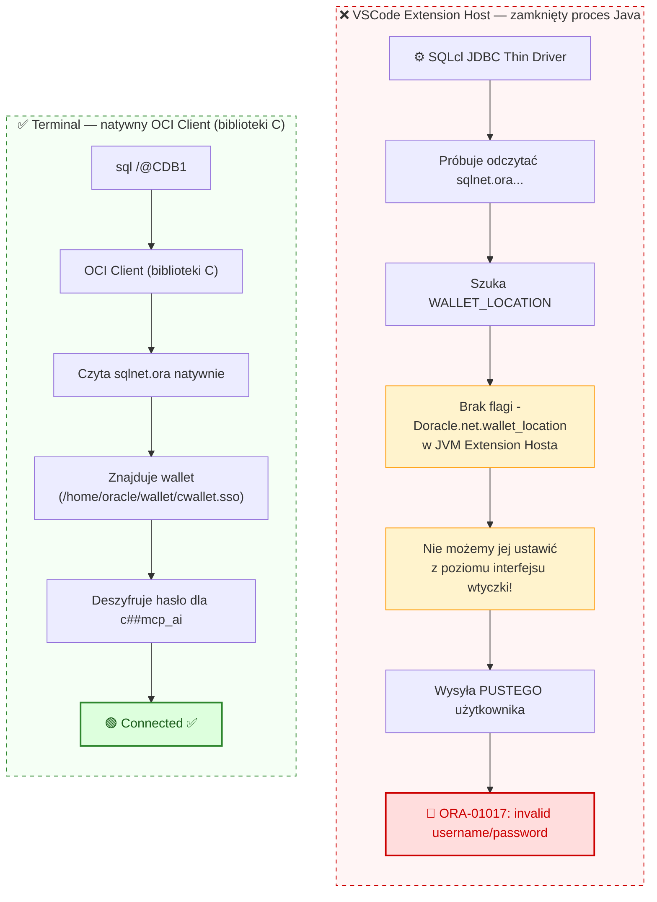
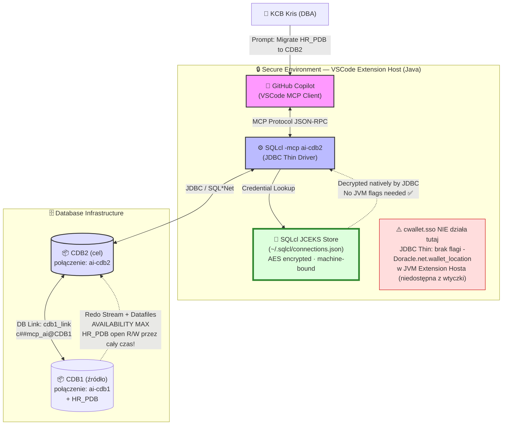
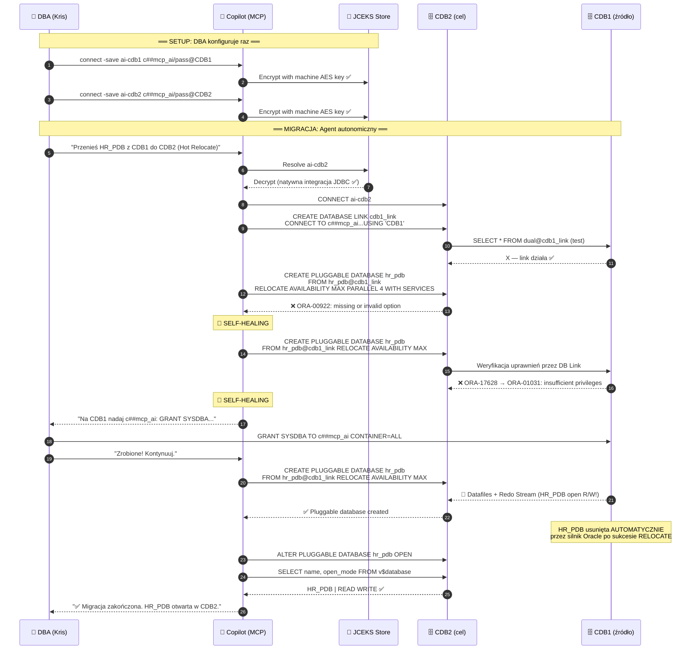

# 🚀 Oracle Database Autonomous Migration with AI Agents (MCP & SQLcl)

 
 
 
 


> **Pragmatic, battle-tested Agentic DBA Workflow** — budowanie prawdziwych rozwiązań wymaga zmierzenia się z rzeczywistością infrastruktury, a nie tylko z teorią. Ten projekt pokazuje zarówno sukcesy jak i kompromisy inżynierskie — łącznie z pivotami, które wynikły z realnych ograniczeń środowiska.

---

> **🔥 AKTUALIZACJA (18.02.2026): Mamy NATYWNE wsparcie dla Oracle Wallet!**
>
> Podczas gdy główna gałąź repozytorium demonstruje solidne **obejście (workaround) oparte na JCEKS** dla GitHub Copilot, opracowałem inżynierską poprawkę protokołu, która umożliwia **Claude Code** bezpośrednie i bezpieczne korzystanie z **Natywnego Oracle Wallet (SEPS)**.
>
> 🚀 **Sprawdź to przełomowe rozwiązanie tutaj:**
> 👉 **[Przejdź do v2: Claude Code + Naprawa Natywnego Walleta i Proxy Protokołu](./claude-mcp-fix/)**

---

## 📖 Spis Treści

- [O projekcie](#-o-projekcie)
- [Kluczowe innowacje](#-kluczowe-innowacje)
- [⚠️ Engineering Pivot: Wallet → JCEKS — Centralne Odkrycie Projektu](#️-engineering-pivot-wallet--jceks--centralne-odkrycie-projektu)
- [Architektura — faktyczna implementacja](#-architektura--faktyczna-implementacja)
- [Wymagania](#-wymagania)
- [Konfiguracja krok po kroku](#️-konfiguracja-krok-po-kroku)
- [Hot Relocate — Faktyczny Przebieg Migracji](#-hot-relocate--faktyczny-przebieg-migracji)
- [AI Self-Healing — Analiza DBA](#-ai-self-healing--analiza-dba)
- [Bezpieczeństwo](#-bezpieczeństwo)
- [Rozwiązywanie Problemów](#-rozwiązywanie-problemów)
- [Struktura Repozytorium](#️-struktura-repozytorium)
- [FAQ](#-faq)
- [Licencja](#-licencja)

---

## 📖 O projekcie

Ten projekt jest **Proof of Concept (PoC)** demonstrujący użycie **Model Context Protocol (MCP)** do zarządzania bazami danych Oracle przez autonomicznego Agenta AI — GitHub Copilot w VSCode.

Zrealizowana operacja to **Hot Relocate PDB (Pluggable Database) z zerowym przestojem** — z instancji CDB1 do CDB2, wykonana metodą **PULL** przez Database Link z klauzulą `AVAILABILITY MAX`. Agent działał bez ręcznego logowania i bez przekazywania haseł do modelu językowego (LLM).

### 🎯 To nie jest zwykła administracja. To **Agentic DBA Workflow poziomu L5**.

Ty piszesz: *"Przenieś bazę HR_PDB do CDB2"*.
Agent planuje, wykonuje, napotyka błędy, **sam je diagnozuje, poprawia i kończy zadanie**, po czym raportuje wynik — bez wiedzy o Twoich hasłach.

---

## 🔑 Kluczowe Innowacje

### 1. ⭐ Zero-Password LLM Interaction — SQLcl JCEKS Store

Model językowy (Copilot) **nigdy nie widzi hasła**. Agent wysyła do SQLcl komendę `connect ai-cdb1`. SQLcl odczytuje hasło z lokalnego, zaszyfrowanego magazynu JCEKS i nawiązuje połączenie — bez żadnego udziału LLM.

```bash
# DBA konfiguruje raz (jedyna chwila kiedy hasło pojawia się w terminalu):
sql /nolog
SQL> connect -save ai-cdb1 c##mcp_ai/HasloTajne@CDB1
SQL> connect -save ai-cdb2 c##mcp_ai/HasloTajne@CDB2

# Agent AI od teraz łączy się tak:
sql -mcp ai-cdb1    # ← żadnego hasła w wywołaniu — LLM go nie widzi
```

> **Dlaczego JCEKS, nie Oracle Wallet?** Oracle Wallet zawiódł z VSCode/JDBC Thin. To centralne odkrycie tego projektu — patrz sekcja [Engineering Pivot](#️-engineering-pivot-wallet--jceks--centralne-odkrycie-projektu).

### 2. Hot Relocate — Zero Downtime (AVAILABILITY MAX)

Zamiast klasycznej zimnej migracji (Close → Unplug → Drop → Plug), Agent wykonał **Hot Relocate** — operację, gdzie baza źródłowa pozostaje w trybie `READ WRITE` przez cały czas. Synchronizacja danych i Redo Log odbywa się w tle. Przestój to sekundy, nie minuty.

```sql
-- Jedna komenda, wykonana WYŁĄCZNIE na CDB2 (metoda PULL):
CREATE PLUGGABLE DATABASE hr_pdb
  FROM hr_pdb@cdb1_link
  RELOCATE AVAILABILITY MAX;
```

### 3. AI Self-Healing — Autonomiczne Debugowanie w Czasie Rzeczywistym

Agent **samodzielnie** zdiagnozował i naprawił dwa błędy Oracle, bez interwencji DBA:
- `ORA-00922` → poprawił składnię SQL (zbyt wiele opcji)
- `ORA-01031` (przez `ORA-17628`) → zrozumiał, że Hot Relocate wymaga `SYSDBA` do czytania Online Redo Logs, i poprosił o nadanie uprawnienia

**To jest Święty Graal Agentic AI w IT.**

---

## ⚠️ Engineering Pivot: Wallet → JCEKS — Centralne Odkrycie Projektu

> **Jeśli trafiłeś tu przez wyszukiwanie "SQLcl MCP wallet not working" lub "ORA-01017 VSCode MCP" — ta sekcja jest dla Ciebie. Walczą z tym architekci na całym świecie.**

### Punkt wyjścia: Oracle Wallet (SEPS) — teoria

Standardowym podejściem jest **Oracle Wallet (SEPS)** — portfel kryptograficzny, w którym DBA przechowuje hasła. Klient łączy się przez alias TNS bez podawania hasła.

```bash
# Wallet skonfigurowany i DZIAŁA poprawnie z terminala:
mkstore -wrl /home/oracle/wallet -createCredential CDB1 c##mcp_ai "passwd"
mkstore -wrl /home/oracle/wallet -createCredential CDB2 c##mcp_ai "passwd"

mkstore -wrl /home/oracle/wallet -listCredential
# 4: CDB2 c##mcp_ai
# 3: CDB1 c##mcp_ai
# 2: CDB2_SYS SYS
# 1: CDB1_SYS SYS

sql /@CDB1_SYS AS SYSDBA  # ← łączy bez hasła z terminala ✅
```

### Zderzenie ze ścianą: JDBC Thin Driver w VSCode

Próba zapisania połączenia przez wallet dla SQLcl MCP:

```sql
SQL> connect -save ai-cdb1 /@CDB1
Name:     ai-cdb1
Connect String: CDB1
User:            ← PUSTY!
Password: not saved ← PUSTE!
Connected.       ← pozorny sukces, wkrótce: ORA-01017
```

**Sygnał alarmowy**: `User: (pusty)`. Sterownik JDBC nie odczytał poświadczeń z portfela.

### 🔬 Głęboka Analiza: Dlaczego JDBC Thin Zignorował cwallet.sso?

Kiedy użyłeś komendy `connect -save ai-cdb1 /@CDB1`, polegałeś na tym, że sterownik weźmie alias `CDB1`, zajrzy do pliku `sqlnet.ora`, znajdzie portfel zdefiniowany przez `mkstore` i wyciągnie z niego hasło dla `c##mcp_ai`.

W **terminalu** (gdzie działa natywny klient Oracle OCI) to działa bezbłędnie. Jednak **JDBC Thin Driver**, wbudowany w zamknięty proces Java wtyczki VS Code, jest bardzo "oporny" na czytanie zewnętrznych portfeli (SEPS) dla pustych poświadczeń, jeśli nie przekaże mu się do wirtualnej maszyny Javy specjalnych flag (`-Doracle.net.wallet_location`). Extension Host ich nie posiada, więc wysłał do bazy po prostu "pustego" użytkownika, co Listener z miejsca odrzucił.

Oracle dostarcza **dwa całkowicie różne sterowniki** połączeń:

| Cecha | OCI Client (natywny) | JDBC Thin Driver |
|-------|---------------------|-----------------|
| **Środowisko** | Terminal Linux, sqlplus | Procesy Java, VSCode Extension Host |
| **Czyta cwallet.sso?** | ✅ TAK — przez `sqlnet.ora` | ⚠️ TYLKO z jawną flagą JVM |
| **Wymagana flaga JVM** | Nie dotyczy | `-Doracle.net.wallet_location=/path` |
| **VSCode Extension Host** | Nie używa | Używa — **ale bez tej flagi!** |

**Anatomia awarii wewnątrz VSCode:**



### ✅ Rozwiązanie: Wewnętrzny Sejf SQLcl (JCEKS)

Zamiast walczyć z zewnętrznym portfelem dla procesu Java, którego nie kontrolujemy, używamy **wbudowanego, szyfrowanego magazynu poświadczeń SQLcl**. Działa to tak samo bezpiecznie — hasło zostaje zaszyfrowane kluczem maszynowym na Linuxie, sztuczna inteligencja go nie widzi, ale sterownik JDBC bez problemu potrafi je zdekodować w locie.

```sql
-- Prawidłowe podejście dla VSCode MCP:
sql /nolog
SQL> connect -save ai-cdb1 c##mcp_ai/SilneHasloDlaAI_2026#@CDB1
-- Name: ai-cdb1 | User: c##mcp_ai | Connected ✅ — hasło zapisane w JCEKS!

SQL> connect -save ai-cdb2 c##mcp_ai/SilneHasloDlaAI_2026#@CDB2
-- Name: ai-cdb2 | User: c##mcp_ai | Connected ✅
```

**Co SQLcl robi pod maską:**
- Generuje unikalny klucz AES powiązany z Twoją maszyną
- Szyfruje hasło w formacie **JCEKS** (Java KeyStore — standard Enterprise)
- Zapisuje w `~/.sqlcl/connections.json` (plik sterylny, bez jawnego hasła)
- JDBC Thin przy `sql -mcp ai-cdb1` odczytuje JCEKS **natywnie** — bez żadnych flag JVM

**Inżynierski wniosek:**

> Problem polega na tym, że natywny portfel `cwallet.sso` jest idealnie rozumiany przez biblioteki napisane w C (OCI), z których korzysta terminal Linuxa. Z kolei wewnętrzny sterownik JDBC Thin w Extension Hoście VS Code wymagałby jawnych parametrów JVM, do których z poziomu interfejsu wtyczki Microsoftu i Oracle **po prostu nie mamy dostępu**. Obejście przez magazyn poświadczeń SQLcl to nadal mechanizm **klasy Enterprise** — pod maską SQLcl generuje unikalny klucz AES i szyfruje hasło w formacie JCEKS. Cel bezpieczeństwa (LLM nie widzi hasła) został osiągnięty.

---

## 🏗 Architektura — faktyczna implementacja

### Diagram komponentów



### Diagram sekwencji — faktyczny przebieg z błędami i self-healing



---

## 🔧 Wymagania

| Komponent | Wersja | Uwagi |
|-----------|--------|-------|
| Oracle Database | 26ai (23ai+) | Architektura Multitenant, CDB/PDB |
| SQLcl | **25.2 lub nowszy** | Z obsługą flagi `-mcp` i `connect -save` |
| Java | JDK 11+ | Wbudowany w SQLcl |
| AI Client | VSCode + GitHub Copilot | Lub: Claude Desktop, Cline, Cursor |
| System | Oracle Linux 8/9, RHEL | 64-bit, min 8GB RAM |

### Weryfikacja środowiska

```bash
# SQLcl (MUSI być 25.2+)
sql -version
# SQLcl: Release 25.2.0.0 Production

# Bazy danych
ps -ef | grep pmon
# ora_pmon_CDB1, ora_pmon_CDB2

# Listener
lsnrctl status
# Service "CDB1" has 1 instance(s)
# Service "CDB2" has 1 instance(s)
```

---

## ⚙️ Konfiguracja krok po kroku

### Krok 1: Instalacja Oracle 26ai

```bash
# Rozpakowanie ORACLE_HOME
mkdir -p /u01/app/oracle/product/26.0.0/dbhome_1
cd /u01/app/oracle/product/26.0.0/dbhome_1
unzip -q /home/oracle/ora26aihome.zip

# Instalacja przez plik odpowiedzi (bez GUI)
./runInstaller -silent \
  -responseFile /home/oracle/db_home_fs_26ai.rsp \
  -ignorePrereqFailure
```

Plik odpowiedzi: [`config/oracle/db_home_fs_26ai.rsp`](config/oracle/db_home_fs_26ai.rsp)

### Krok 2: Tworzenie CDB1 i CDB2

```bash
chmod 700 scripts/installation/create_cdb_26ai_v3.sh
./scripts/installation/create_cdb_26ai_v3.sh
```

**Co robi skrypt:**
- **CDB1** z PDB `HR_PDB` (źródło migracji)
- **CDB2** pusta (cel migracji)
- `totalMemory 2560` — twarda alokacja 2.5GB (balans SGA + vector operations)
- `vector_memory_size=256M` — zmniejszone na czas DBCA (więcej przestrzeni dla procesu instalacji)
- FRA: 12GB (eliminuje ostrzeżenie DBT-06801)
- `optimizer_adaptive_plans=true`, `-ignorePreReqs`

**Jeśli DBCA się nie powiedzie — cleanup:**
```bash
sudo ./scripts/installation/cleanup_failed_dbca.sh
# Czyści oratab, pliki danych, dbs/*CDB1*, dbs/*CDB2*
```

### Krok 3: Konfiguracja sieci (Listener + TNS)

```bash
bash scripts/installation/setup_network_26ai.sh
```

Generuje `listener.ora` i `tnsnames.ora` (CDB1, CDB2, HR_PDB), restartuje Listener. Proces LREG automatycznie zarejestruje bazy w ciągu ~60 sekund.

```bash
lsnrctl services | grep -E "CDB1|CDB2|HR_PDB"
```

### Krok 4: Włączenie trybu ARCHIVELOG

```sql
-- Wykonaj dla CDB1:
cdb1    -- alias środowiskowy
sqlplus / as sysdba
@scripts/database/enable_archivelog_mode.sql

-- Oczekiwany wynik:
-- Database log mode:  Archive Mode
-- Automatic archival: Enabled
-- Archive destination: USE_DB_RECOVERY_FILE_DEST

-- Powtórz dla CDB2
cdb2
sqlplus / as sysdba
@scripts/database/enable_archivelog_mode.sql
```

### Krok 5: Tworzenie użytkownika AI (c##mcp_ai)

Wykonaj na **CDB1 i CDB2**:

```sql
-- scripts/security/AI_PDB_Migration_Role.sql
-- (OSTATECZNA WERSJA — z pełnymi uprawnieniami do migracji)

CREATE USER c##mcp_ai IDENTIFIED BY SilneHasloDlaAI_2026# CONTAINER=ALL;

-- Uprawnienia do operacji PDB
GRANT CREATE SESSION, CREATE DATABASE LINK TO c##mcp_ai CONTAINER=ALL;
GRANT CREATE PLUGGABLE DATABASE, ALTER PLUGGABLE DATABASE,
      DROP PLUGGABLE DATABASE TO c##mcp_ai CONTAINER=ALL;
GRANT CREATE ANY DIRECTORY, DROP ANY DIRECTORY TO c##mcp_ai CONTAINER=ALL;

-- Role administracyjne (bez SYSDBA dla standardowych operacji)
GRANT DBA, CDB_DBA TO c##mcp_ai CONTAINER=ALL;
GRANT SELECT ANY DICTIONARY TO c##mcp_ai CONTAINER=ALL;

PROMPT Konto c##mcp_ai gotowe do automatyzacji PDB!
```

### Krok 6: Oracle Wallet — dla terminala (opcjonalne, dokumentacja procesu)

> **Kontekst**: Wallet skonfigurowano zgodnie z planem. Działa poprawnie z terminala (OCI Client). **Dla VSCode/MCP zawiódł** — zastąpiony przez JCEKS (Krok 7).

```bash
mkdir -p /home/oracle/wallet
mkstore -wrl /home/oracle/wallet -create

# Credentials dla SYS (do adminstracji z terminala)
mkstore -wrl /home/oracle/wallet -createCredential CDB1_SYS SYS "HasloSYS"
mkstore -wrl /home/oracle/wallet -createCredential CDB2_SYS SYS "HasloSYS"

# Credentials dla c##mcp_ai (próba wallet → zawiodła z VSCode)
mkstore -wrl /home/oracle/wallet -createCredential CDB1 c##mcp_ai "HasloAI"
mkstore -wrl /home/oracle/wallet -createCredential CDB2 c##mcp_ai "HasloAI"

# Weryfikacja zawartości portfela:
mkstore -wrl /home/oracle/wallet -listCredential
# 4: CDB2 c##mcp_ai
# 3: CDB1 c##mcp_ai
# 2: CDB2_SYS SYS
# 1: CDB1_SYS SYS

# Test z terminala (OCI Client — działa!):
sql /@CDB1_SYS AS SYSDBA   # ✅
```

**sqlnet.ora** (dla OCI Client / terminala):
```ini
WALLET_LOCATION =
  (SOURCE = (METHOD = FILE) (METHOD_DATA = (DIRECTORY = /home/oracle/wallet)))
SQLNET.WALLET_OVERRIDE = TRUE
SSL_CLIENT_AUTHENTICATION = FALSE
```

### ⭐ Krok 7: SQLcl JCEKS — Konfiguracja dla VSCode MCP (krytyczny krok)

> **To jest punkt zwrotny projektu.** Zastępuje wallet dla środowiska VSCode. Hasło zaszyfrowane kluczem AES powiązanym z maszyną — LLM nigdy go nie widzi.

```bash
# Uruchom SQLcl w trybie offline
sql /nolog
```

```sql
-- Zapisanie połączenia CDB1 do wewnętrznego sejfu JCEKS
SQL> connect -save ai-cdb1 c##mcp_ai/SilneHasloDlaAI_2026#@CDB1
-- Name:     ai-cdb1
-- User:     c##mcp_ai    ← NIE jest pusty! ✅
-- Connected ✅ — hasło zaszyfrowane w JCEKS

SQL> connect -save ai-cdb2 c##mcp_ai/SilneHasloDlaAI_2026#@CDB2
-- Name:     ai-cdb2
-- User:     c##mcp_ai ✅

SQL> disconnect
SQL> exit
```

**Weryfikacja:**
```bash
# Lista zapisanych połączeń
sql -l
# NAME      CONNECT STRING   USER
# ai-cdb1   CDB1             c##mcp_ai
# ai-cdb2   CDB2             c##mcp_ai

# Test połączenia bez hasła (tylko dla weryfikacji)
echo "SELECT user, sys_context('USERENV','CON_NAME') con FROM dual;" \
  | sql -s ai-cdb1
# C##MCP_AI   CDB1$ROOT ✅
```

### Krok 8: Dodatkowe Uprawnienia dla Hot Relocate (SYSDBA)

> **Dlaczego?** Hot Relocate czyta Online Redo Logs serwera źródłowego przez DB Link. Oracle bezwzględnie wymaga `SYSDBA` lub `SYSOPER` po stronie źródła. Agent sam to zdiagnozował przez `ORA-17628 → ORA-01031`.

```sql
-- Wykonaj na CDB1 jako SYS:
GRANT CREATE PLUGGABLE DATABASE TO c##mcp_ai CONTAINER=ALL;
GRANT CDB_DBA TO c##mcp_ai CONTAINER=ALL;
GRANT SYSDBA TO c##mcp_ai CONTAINER=ALL;
```

### Krok 9: Konfiguracja MCP w VSCode

**Wrapper script** (`scripts/mcp/mcp_sqlcl_wrapper.sh`):

```bash
#!/bin/bash
# ==============================================================================
# Script name: mcp_sqlcl_wrapper.sh
# Author: KCB Kris
# Description:
# [PL] Wrapper SQLcl dla MCP. Izoluje środowisko od login.sql i gwarantuje
#      poprawne zmienne środowiskowe dla procesu działającego w tle VSCode.
#      Przekazuje nazwę zapisanego połączenia JCEKS do SQLcl jako serwer MCP.
# [EN] SQLcl wrapper for MCP. Isolates environment from login.sql and ensures
#      correct environment variables for VSCode background process.
#      Passes saved JCEKS connection name to SQLcl as MCP server.
# ==============================================================================

# VSCode Extension Host nie dziedziczy .bashrc — czyścimy potencjalne konflikty
unset SQLPATH
unset ORACLE_PATH

# Twarda inicjalizacja środowiska
export ORACLE_HOME=/u01/app/oracle/product/26.0.0/dbhome_1
export TNS_ADMIN=$ORACLE_HOME/network/admin
export PATH=$ORACLE_HOME/bin:$PATH

# UTF-8 zapobiega halucynacjom AI na znakach specjalnych
export NLS_LANG=AMERICAN_AMERICA.AL32UTF8

# Uruchomienie SQLcl z argumentem = nazwa zapisanego połączenia JCEKS
# Przykład wywołania: mcp_sqlcl_wrapper.sh -mcp ai-cdb1
exec $ORACLE_HOME/bin/sql "$@"
```

**Konfiguracja VSCode** (`config/mcp/vscode-mcp-config.json`):

```json
{
  "mcpServers": {
    "oracle-dba-cdb1": {
      "command": "/home/oracle/scripts/mcp/mcp_sqlcl_wrapper.sh",
      "args": ["-mcp", "ai-cdb1"],
      "env": {
        "ORACLE_HOME": "/u01/app/oracle/product/26.0.0/dbhome_1",
        "TNS_ADMIN": "/u01/app/oracle/product/26.0.0/dbhome_1/network/admin",
        "NLS_LANG": "AMERICAN_AMERICA.AL32UTF8"
      }
    },
    "oracle-dba-cdb2": {
      "command": "/home/oracle/scripts/mcp/mcp_sqlcl_wrapper.sh",
      "args": ["-mcp", "ai-cdb2"],
      "env": {
        "ORACLE_HOME": "/u01/app/oracle/product/26.0.0/dbhome_1",
        "TNS_ADMIN": "/u01/app/oracle/product/26.0.0/dbhome_1/network/admin",
        "NLS_LANG": "AMERICAN_AMERICA.AL32UTF8"
      }
    }
  }
}
```

> **Kluczowa różnica vs wallet**: argument `"ai-cdb1"` (nazwa JCEKS) zamiast `"/@CDB1"` (wallet alias, który zawiódł). SQLcl rozwiązuje poświadczenia wewnętrznie przez JCEKS.

---

## 🚀 Hot Relocate — Faktyczny Przebieg Migracji

### Prompt użytkownika

```
Jesteś moim doświadczonym Oracle DBA.
Połączenia "ai-cdb1" oraz "ai-cdb2" działają świetnie i dają Ci potężne
uprawnienia do zarządzania kontenerami (CDB_DBA).

Twoim zadaniem jest relokacja bazy HR_PDB z instancji CDB1 do CDB2
bez przestoju (Hot Relocate).

Przygotuj plan i podaj wszystkie komendy. Wyjaśnij, jak w Oracle 23ai/26ai
działa mechanizm relokacji w locie.
```

### Faktyczne komendy w kolejności wykonania

**Krok 1: Połączenie z bazą docelową (PULL — tylko CDB2 inicjuje)**
```sql
CONNECT ai-cdb2
-- JCEKS deszyfruje hasło natywnie, JDBC łączy z CDB2 ✅
```

**Krok 2: Weryfikacja źródła**
```sql
-- (przez ai-cdb1)
SELECT con_id, name, open_mode FROM v$pdbs WHERE name='HR_PDB';
-- HR_PDB | READ WRITE ✅
```

**Krok 3: Database Link z CDB2 do CDB1**
```sql
CREATE DATABASE LINK cdb1_link
  CONNECT TO c##mcp_ai IDENTIFIED BY "passwd"
  USING 'CDB1';
-- Database link created ✅
```

**Krok 4: Test linku**
```sql
SELECT * FROM dual@cdb1_link;
-- X ✅ — link działa, uprawnienia podstawowe OK
```

**Krok 5: Próba #1 — błąd składni (AI sam poprawił)**
```sql
-- ❌ AI spróbował zaawansowanych opcji
CREATE PLUGGABLE DATABASE hr_pdb
  FROM hr_pdb@cdb1_link
  RELOCATE AVAILABILITY MAX PARALLEL 4 WITH SERVICES;
-- ORA-00922: missing or invalid option

-- 🔄 AI analizuje błąd, usuwa nieobsługiwane klauzule, próbuje ponownie ↓
```

**Krok 6: Próba #2 — brak uprawnień do Redo (AI sam zdiagnozował)**
```sql
-- ❌ Poprawna składnia, ale c##mcp_ai na CDB1 bez SYSDBA
CREATE PLUGGABLE DATABASE hr_pdb
  FROM hr_pdb@cdb1_link
  RELOCATE AVAILABILITY MAX;
-- ORA-17628: Oracle error 1031 returned by remote Oracle server
-- ORA-01031: insufficient privileges

-- 🔄 AI: "Hot Relocate musi czytać Online Redo Logs przez sieć
--         → wymagany SYSDBA lub SYSOPER na CDB1.
--         Proszę o: GRANT SYSDBA TO c##mcp_ai CONTAINER=ALL"
-- → DBA nadał uprawnienia na CDB1 ↓
```

**Krok 7: ✅ Hot Relocate — SUKCES**
```sql
CREATE PLUGGABLE DATABASE hr_pdb
  FROM hr_pdb@cdb1_link
  RELOCATE AVAILABILITY MAX;
-- Pluggable database created ✅
-- (HR_PDB na CDB1 usunięta AUTOMATYCZNIE przez silnik Oracle)
```

**Krok 8: Otwarcie i weryfikacja**
```sql
ALTER PLUGGABLE DATABASE hr_pdb OPEN;

ALTER SESSION SET CONTAINER=HR_PDB;
SELECT name, open_mode FROM v$database;
-- HR_PDB | READ WRITE ✅

SELECT name FROM v$services;
-- hr_pdb ✅
```

### Jak działa Hot Relocate (AVAILABILITY MAX) w Oracle 23ai/26ai?

Hot Relocate to migracja PDB w locie między CDB **bez przestoju** aplikacji:

1. **Inicjalizacja (PULL)** — CDB2 inicjuje operację przez DB Link do CDB1
2. **Kopiowanie plików w tle** — datafiles rejestrowane w CDB2 podczas gdy HR_PDB `READ WRITE` na CDB1
3. **Synchronizacja Redo (`AVAILABILITY MAX`)** — CDB2 na bieżąco aplikuje zmiany z Online Redo Logs CDB1 przez DB Link. To wymaga `SYSDBA`/`SYSOPER` na źródle
4. **Finalny switch** — minimalne okno (sekundy) — serwisy i sesje przełączane do CDB2
5. **Automatyczne sprzątanie** — CDB1 **automatycznie** usuwa stary PDB po potwierdzeniu sukcesu. Ręczny `DROP` byłby błędem (bazy już nie ma)

---

## 🧠 AI Self-Healing — Analiza DBA

Ocena zachowania Agenta przez pryzmat doświadczonego Oracle DBA:

### ✅ Co Agent zrobił genialnie

**1. Samokorekta Składni (ORA-00922)**

Copilot najpierw spróbował "przekombinować" z opcjami (`PARALLEL 4 WITH SERVICES`), dostał błąd składni z bazy, przeczytał go i **samodzielnie poprawił kod**. Nie przerwał pracy, nie prosił o pomoc.

**2. Świadomość klauzuli `AVAILABILITY MAX`**

Agent użył tej zaawansowanej opcji **bez podpowiedzi** ze strony DBA. `AVAILABILITY MAX` to prawdziwa klauzula Oracle (od 12.2, kontynuowana w 26ai), instruująca silnik, aby utrzymywał dostępność źródłowej bazy przez cały czas relokacji. Nie jest to halucynacja — to poprawny research. Zrobił tu świetną robotę.

**3. Diagnoza Uprawnień Zdalnych (ORA-17628 → ORA-01031)**

Kiedy operacja uderzyła w błąd na serwerze zdalnym, Agent poprawnie wywnioskował:
- DB Link działa (test SELECT z dual przeszedł)
- Błąd pochodzi z CDB1 (Oracle error returned by remote server)
- Hot Relocate czyta Online Redo Logs przez sieć → to wymaga `SYSDBA`/`SYSOPER`
- Standardowy `CDB_DBA` tu nie wystarcza

**Dlaczego to takie cenne?** Standardowe klonowanie PDB (Cold Clone) wystarcza z `CREATE PLUGGABLE DATABASE`. Hot Relocate (żywy stream Redo przez sieć) **bezwzględnie wymaga** `SYSDBA` lub `SYSOPER`. AI to zrozumiał bez podpowiedzi — to jest głębokie zrozumienie mechaniki Oracle.

**4. Transparentność Post-Mortem**

Agent udokumentował własne błędy w raporcie końcowym. Na wagę złota przy audytach bezpieczeństwa — dokładnie widać ewolucję procesu decyzyjnego.

**5. Świadomość Architektury JCEKS**

W raporcie i na diagramie Mermaid Agent jawnie zaznaczył: *"hasło w SQLcl przechowywane zaszyfrowane"*. Rozumiał, że operuje w środowisku bezpiecznym — poświadczenia wyciągane z JCEKS, a on sam ich nie widzi.

### ⚠️ Błędy Agenta (przed korektą DBA)

| Błąd | Opis | Korekta |
|------|------|---------|
| Kierunek PUSH | Pierwotna propozycja: `ALTER PLUGGABLE DATABASE ... RELOCATE TO` (nie istnieje) | DBA wyjaśnił: Oracle Multitenant = zawsze PULL na docelowym |
| Brakujący prefiks | `FROM cdb1_link` zamiast `FROM hr_pdb@cdb1_link` | Oracle wymaga `pdb_name@link_name` |
| Zbędny DROP | Proponował ręczny `DROP PLUGGABLE DATABASE` na CDB1 | RELOCATE automatycznie usuwa źródło po sukcesie |

> **To najpiękniejszy przykład Agentic Workflow** — AI samodzielnie zdebugowało problem w czasie rzeczywistym. Byliśmy świadkami, jak sztuczna inteligencja analizuje błędy Oracle, rozumie architekturę szyfrowania i prosi o precyzyjnie określone uprawnienia. **Zbudowałeś pełnoprawnego agenta L5 do zarządzania cyklem życia baz danych.**

---

## 🔒 Bezpieczeństwo

### Macierz: Oracle Wallet vs SQLcl JCEKS

| Aspekt | Oracle Wallet (cwallet.sso) | SQLcl JCEKS Store |
|--------|---------------------------|-------------------|
| **Działa z VSCode MCP** | ❌ Nie (JDBC Thin: brak flagi JVM) | ✅ Tak (natywna integracja JDBC) |
| **Działa w terminalu** | ✅ Tak (OCI Client) | ✅ Tak |
| **LLM widzi hasło** | ❌ Nie | ❌ Nie |
| **Szyfrowanie** | AES256, Oracle SEPS | AES, JCEKS (Java Enterprise standard) |
| **Machine-bound** | Nie (portfel przenośny) | Tak (klucz powiązany z maszyną) |
| **Konfiguracja** | `mkstore` + `sqlnet.ora` | `connect -save` — jedna komenda |
| **Poziom bezpieczeństwa** | Enterprise ✅ | Enterprise ✅ |
| **Rekomendacja** | Terminal/CLI | **VSCode MCP ← ten projekt** |

### Weryfikacja szyfrowania połączenia

```sql
@scripts/security/check_connection_encryption.sql
-- Weryfikuje: algorytm szyfrowania, metodę uwierzytelniania
-- Native Network Encryption (AES256) domyślnie włączone w Oracle 26ai
```

### Audyt operacji AI

```sql
CREATE AUDIT POLICY ai_mcp_audit
  ACTIONS
    ALTER PLUGGABLE DATABASE,
    CREATE PLUGGABLE DATABASE,
    DROP PLUGGABLE DATABASE,
    CREATE DATABASE LINK;

AUDIT POLICY ai_mcp_audit BY c##mcp_ai;

-- Podgląd historii operacji AI:
SELECT event_timestamp, action_name, sql_text
FROM unified_audit_trail
WHERE dbusername = 'C##MCP_AI'
ORDER BY event_timestamp DESC;
```

---

## 🐛 Rozwiązywanie Problemów

### Problem 1: ORA-01017 po `connect -save /@CDB1` — puste User/Password

**Objaw:** `User: (pusty)`, `Password: not saved` w logu SQLcl.

**Przyczyna:** JDBC Thin w VSCode Extension Host nie odczytał cwallet.sso — brak flagi `-Doracle.net.wallet_location` w JVM (nieosiągalna z wtyczki VSCode).

**Rozwiązanie:**
```sql
-- ❌ Nie działa z VSCode MCP (wallet alias):
connect -save ai-cdb1 /@CDB1

-- ✅ Działa (jawne poświadczenia → JCEKS):
connect -save ai-cdb1 c##mcp_ai/TwojeHaslo@CDB1
```

### Problem 2: ORA-17628 / ORA-01031 podczas RELOCATE

**Przyczyna:** Hot Relocate czyta Online Redo Logs przez sieć → wymaga `SYSDBA`/`SYSOPER`.

**Rozwiązanie:**
```sql
-- Na CDB1 jako SYS:
GRANT SYSDBA TO c##mcp_ai CONTAINER=ALL;
```

### Problem 3: ORA-00922 przy `CREATE PLUGGABLE DATABASE ... RELOCATE`

**Przyczyna:** Nieobsługiwana kombinacja klauzul w 26ai.

**Działająca składnia:**
```sql
-- ✅ Zweryfikowane w Oracle 26ai:
CREATE PLUGGABLE DATABASE hr_pdb
  FROM hr_pdb@cdb1_link
  RELOCATE AVAILABILITY MAX;

-- ❌ ORA-00922 (zbyt wiele opcji naraz):
CREATE PLUGGABLE DATABASE hr_pdb
  FROM hr_pdb@cdb1_link
  RELOCATE AVAILABILITY MAX PARALLEL 4 WITH SERVICES;
```

### Problem 4: `FROM cdb1_link` zamiast `FROM hr_pdb@cdb1_link`

**Przyczyna:** Oracle bezwzględnie wymaga `pdb_name@link_name` w składni RELOCATE.

```sql
-- ❌ Błąd:
CREATE PLUGGABLE DATABASE hr_pdb FROM cdb1_link RELOCATE ...

-- ✅ Poprawnie:
CREATE PLUGGABLE DATABASE hr_pdb FROM hr_pdb@cdb1_link RELOCATE ...
```

### Problem 5: Ręczny DROP po udanym RELOCATE wyrzuca błąd

**Przyczyna:** RELOCATE automatycznie usuwa PDB ze źródła po sukcesie. Ręczny `DROP` trafia na obiekt, który już nie istnieje.

```sql
-- ❌ Zbędny krok (Agent proponował, DBA poprawił):
DROP PLUGGABLE DATABASE hr_pdb KEEP DATAFILES;  -- ORA-65011

-- ✅ Po udanym RELOCATE — CDB1 już nie ma HR_PDB:
SELECT name FROM v$pdbs WHERE name='HR_PDB';  -- No rows selected ✅
```

---

## 🗂️ Struktura Repozytorium

```
oracle-ai-mcp-migration/
│
├── README.md                          ← Ten plik
├── LICENSE
├── .gitignore                         ← Chroni wallet, hasła, pliki *.dbf
├── CONTRIBUTING.md
├── CHANGELOG.md
│
├── scripts/
│   ├── installation/
│   │   ├── create_cdb_26ai_v3.sh      ← CDB1+HR_PDB i CDB2 (v3 — poprawna)
│   │   ├── setup_network_26ai.sh      ← Listener + TNS (listener.ora, tnsnames.ora)
│   │   └── cleanup_failed_dbca.sh     ← Czyszczenie po nieudanej instalacji
│   │
│   ├── security/
│   │   ├── AI_PDB_Migration_Role.sql  ← c##mcp_ai (OSTATECZNA wersja)
│   │   └── check_connection_encryption.sql  ← Weryfikacja AES256
│   │
│   ├── database/
│   │   └── enable_archivelog_mode.sql ← ARCHIVELOG dla CDB1 i CDB2
│   │
│   └── mcp/
│       └── mcp_sqlcl_wrapper.sh       ← Wrapper SQLcl (JCEKS, izolacja env)
│
├── config/
│   ├── db_home_fs_26ai.rsp        ← Plik odpowiedzi instalacji
│   ├── grid_restart_26ai.rsp
│   ├── db_home_asm_26ai.rsp
│   └── sqlnet.ora.template        ← WALLET_LOCATION (dla OCI/terminala)
│
└── docs/
    ├── security.md                    
    └── troubleshooting.md
```

---

## ❓ FAQ

**Q: Dlaczego Oracle Wallet nie zadziałał z VSCode?**

VSCode Extension Host uruchamia SQLcl przez JDBC Thin Driver bez flagi JVM `-Doracle.net.wallet_location`. Bez niej JDBC wysyła pustego użytkownika. Terminal używa OCI Client (biblioteki C), który czyta `sqlnet.ora` natywnie. To fundamentalna różnica architektury — nie bug, nie misconfiguration.

**Q: Czy SQLcl JCEKS jest równie bezpieczny jak Oracle Wallet?**

Tak, dla tego przypadku użycia. Obydwa szyfrują hasło (JCEKS: AES, machine-bound), obydwa uniemożliwiają LLM odczytanie hasła. Cel bezpieczeństwa osiągnięty przez oba mechanizmy.

**Q: Dlaczego Hot Relocate, nie Unplug/Plug?**

Hot Relocate oferuje zero-downtime. HR_PDB pozostaje `READ WRITE` podczas całej operacji. Unplug/Plug wymaga `CLOSE IMMEDIATE` — aplikacja niedostępna przez czas operacji.

**Q: Czy SYSDBA jest potrzebne zawsze?**

Nie. `SYSDBA` wymagane jest **tylko** dla Hot Relocate (czytanie Redo Logs przez sieć). Dla Unplug/Plug wystarczy `CREATE PLUGGABLE DATABASE` + `CDB_DBA`.

**Q: Czy DB Link musi używać c##mcp_ai?**

Tak — zgodnie z zasadą Least Privilege i bezpieczeństwa. Użycie `SYS` przez DB Link w produkcji jest niedopuszczalne.

---

## 📜 Disclaimer

To rozwiązanie demonstracyjne (PoC). W środowiskach produkcyjnych dodaj: `Human-in-the-loop` przed `RELOCATE`, ograniczenie uprawnień do minimum, audyt i monitoring. Testuj zawsze na staging przed produkcją.

---

<p align="center">
  <sub>Zbudowane przez praktykującego DBA — z błędami, pivotami i sukcesami włącznie.<br/>Bo tak właśnie wygląda prawdziwa inżynieria.</sub>
</p>
