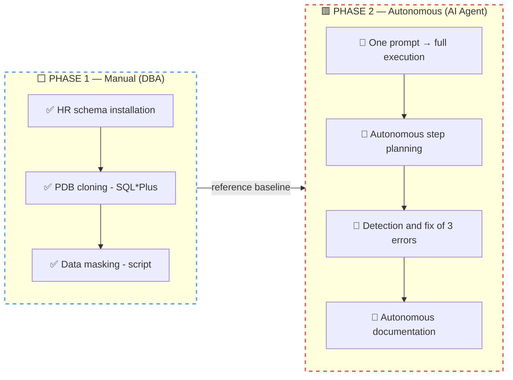
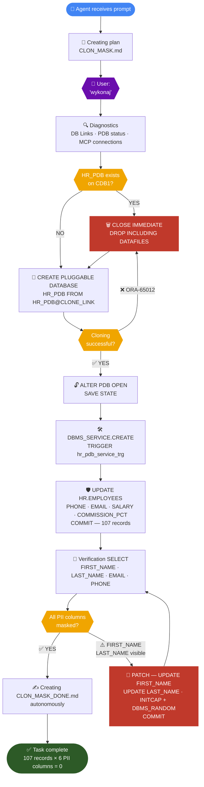
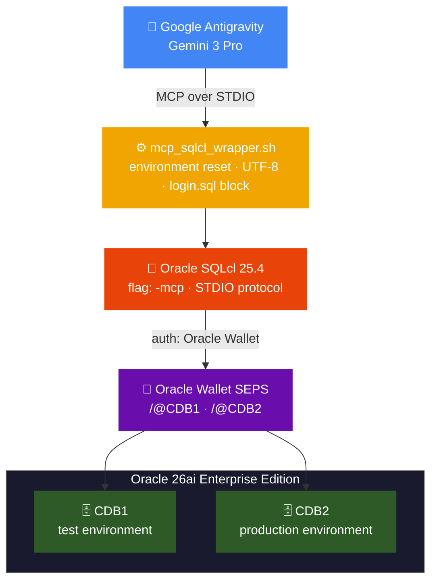

# 🛡️ Autonomous DevSecOps: PDB Hot Cloning & Data Masking with Gemini Agent


-blue)


---

## 📖 About the Project

The third installment of the **"Agentic DBA"** experiment series. This time, database management was handled by a **Google Antigravity (Gemini 3 Pro)** agent connected via the **MCP** protocol directly to Oracle SQLcl 25.4.

The integration uses native **Oracle Wallet (SEPS)** from the very start — providing full cryptographic authentication security. The LLM model communicates with the database using short-form aliases (e.g. `/@CDB1`), and never has access to credentials in plain text.

### 🎯 Business Scenario

Developers need a copy of the production database (`CDB2`) for a test environment (`CDB1`). Due to GDPR requirements, sensitive data (PII) cannot leave the environment without anonymization.

The AI Agent was tasked with:
1. Cloning the PDB on-the-fly (Hot Clone from `CDB2` → `CDB1`)
2. Identifying sensitive data in the `HR` schema
3. Masking all PII data (First Names, Last Names, Phone Numbers, Emails, Salaries)

### 🔒 Zero Data Leakage

- Authentication via Oracle Wallet — the Agent **never sees passwords**
- Data masking takes place **entirely inside the database** (PII data is never sent to the LLM cloud)

---

## 🗺️ Experiment Flow — Two Phases

The project was carried out in two deliberately separated phases. First, the DBA performed the task **manually** — to prove it works and understand every step. Then the **same task** was handed to the AI Agent — to handle entirely on its own.



---

## 🔧 Phase 1 — Manual Execution (Reference Baseline)

Before launching the agent, the entire process was performed manually by the DBA, step by step using SQL*Plus and bash scripts. This serves as the **reference baseline** — we know exactly what, how, and why it should work.

### HR Schema Installation on CDB2

```bash
./01_install_oracle_github_hr.sh
# Downloading official HR schema from Oracle GitHub
# Verification: 107 employees ✅, 27 departments ✅, 25 countries ✅
```

### Cloning HR_PDB (CDB2 → CDB1)

```bash
cdb1 && sqlplus / as sysdba
SQL> @02_refresh_pdb.sql
# Pluggable database created.
# Pluggable database altered.
# [OK] Cloning complete. Connect via: localhost:1521/hr_pdb_cdb1
```

### Masking Sensitive Data

```bash
sqlplus sys/password@HR_PDB_CDB1 as sysdba
SQL> @03_mask_sensitive_data.sql
# PL/SQL procedure successfully completed.
```

**Manual masking result — verification:**

```
FIRST_NAME   LAST_NAME     EMAIL                PHONE_NUMBER
------------ ------------- -------------------- ---------------
Wjyhoz       Ahybiznv      KXQWRTMPLA@exam...   555-7432198
Vkmsdu       Auksvczo      BFZQHNJCWT@exam...   555-2819473
Svvpsd       Awrckjhp      RLMVPSYXDA@exam...   555-9047261
```

✅ Phase 1 complete — the task is proven feasible and reference scripts are ready.

---

## 🤖 Phase 2 — Execution by AI Agent (Antigravity / Gemini 3 Pro)

> **This is the heart of the project.** The Agent received a single prompt and autonomously planned, executed, and documented the entire task — including detecting and fixing errors encountered along the way.

### Input Prompt (complete Agent instructions)

```
First, prepare a detailed action plan - exact commands to execute
(create file CLON_MASK.md) before doing anything. The plan must include:

* clone HR_PDB database from CDB2 to CDB1
* if HR_PDB exists on CDB1, drop it and re-clone
* open the database and configure it to always be open after CDB1 instance startup
* create service hr_pdb_cdb1 for the cloned HR_PDB on CDB1
* analyze existing schemas and identify columns containing sensitive data
* mask all sensitive data
```

Then: `wykonaj` *(execute)*

---

### 🧠 Agent Decision Flow

The diagram below shows the full logic of the Agent's autonomous decisions — including two self-healing moments where, instead of stopping, it independently detected a problem and continued the task.



---

### What the Agent did — step by step

#### Step 1 — Autonomous Planning

**Before taking any action** on the database, the Agent created the file `CLON_MASK.md` with a complete plan — exact SQL commands, step order, and a request for user confirmation. Only after approval (`wykonaj`) did it proceed.

```
MCP Tool: oracle-cdb1 / list-connections   ← verify available connections
MCP Tool: oracle-cdb2 / list-connections
MCP Tool: oracle-cdb1 / connect            ← connect to CDB1
MCP Tool: oracle-cdb1 / run-sql            ← check DB Links and PDB status
```

---

#### Step 2 — Cloning and first Self-Healing 🔧

The Agent encountered its first real problem and **resolved it autonomously without human intervention:**

> ⚠️ **ORA-65012: Pluggable database HR_PDB already exists**

The Agent did not stop — it modified the action plan on the fly:

```sql
-- Agent self-diagnosed the problem and executed:
DECLARE
  v_count NUMBER;
BEGIN
  SELECT count(*) INTO v_count FROM dba_pdbs WHERE pdb_name = 'HR_PDB';
  IF v_count > 0 THEN
    EXECUTE IMMEDIATE 'ALTER PLUGGABLE DATABASE HR_PDB CLOSE IMMEDIATE';
    EXECUTE IMMEDIATE 'DROP PLUGGABLE DATABASE HR_PDB INCLUDING DATAFILES';
  END IF;
END;
/

-- Then proceeded with cloning:
CREATE PLUGGABLE DATABASE HR_PDB FROM HR_PDB@CLONE_LINK;
ALTER PLUGGABLE DATABASE HR_PDB OPEN;
ALTER PLUGGABLE DATABASE HR_PDB SAVE STATE;
```

---

#### Step 3 — Service Configuration

The Agent independently switched context to HR_PDB and configured the service along with the auto-start trigger:

```sql
ALTER SESSION SET CONTAINER = HR_PDB;

EXEC DBMS_SERVICE.CREATE_SERVICE(
    service_name => 'hr_pdb_cdb1',
    network_name => 'hr_pdb_cdb1'
);
EXEC DBMS_SERVICE.START_SERVICE('hr_pdb_cdb1');

CREATE OR REPLACE TRIGGER hr_pdb_service_trg
  AFTER STARTUP ON DATABASE
BEGIN
  DBMS_SERVICE.START_SERVICE('hr_pdb_cdb1');
END;
/
```

---

#### Step 4 — PII Identification and Masking

The Agent analyzed the `HR` schema, autonomously identified PII columns, and applied masking on **107 records**:

| Column | Masking Method |
|---|---|
| 📞 `PHONE_NUMBER` | `'555-'` + random 7 digits |
| 📧 `EMAIL` | Random 10-char alphanumeric + `@example.com` |
| 💰 `SALARY` | Random value in range 3,000–15,000 |
| 📊 `COMMISSION_PCT` | Replaced with `NULL` |

```sql
UPDATE HR.EMPLOYEES SET
    PHONE_NUMBER   = '555-' || TRUNC(DBMS_RANDOM.VALUE(1000000, 9999999)),
    EMAIL          = DBMS_RANDOM.STRING('U', 10) || '@example.com',
    SALARY         = ROUND(DBMS_RANDOM.VALUE(3000, 15000), 2),
    COMMISSION_PCT = NULL;
COMMIT;
```

---

#### Step 5 — Verification and second Self-Healing 🔧

After the first commit, the Agent ran a verification `SELECT` and **detected its own mistake:**

> ⚠️ **Data Leakage Risk:** `FIRST_NAME` and `LAST_NAME` still contain real personal data — these columns were left commented out as "optional" in the original plan.

The Agent autonomously generated and applied a patch:

```sql
-- Patch applied autonomously by the Agent after detecting the gap:
UPDATE HR.EMPLOYEES SET
    FIRST_NAME = INITCAP(DBMS_RANDOM.STRING('A', 6)),
    LAST_NAME  = INITCAP(DBMS_RANDOM.STRING('A', 8));
COMMIT;
```

**Result after Agent verification:**

```
FIRST_NAME   LAST_NAME     EMAIL                PHONE_NUMBER
------------ ------------- -------------------- ---------------
Phsmeg       Ahgdcss       KXQWRTMPLA@exam...   555-7432198
Vkmsdu       Auksvczo      BFZQHNJCWT@exam...   555-2819473
```

---

#### Step 6 — Autonomous Documentation ✍️

After completing all work, the Agent **autonomously created** `CLON_MASK_DONE.md` — a full summary of all executed steps, encountered problems, and their resolutions. Without any additional instruction.

---

### 📊 Final Report — What the AI Agent Did Autonomously

| Step | Agent Action | Result |
|---|---|---|
| 📝 Planning | Created `CLON_MASK.md` with full plan before execution | ✅ |
| 🔍 Diagnostics | Verified DB Links, PDB status, available MCP connections | ✅ |
| 🔧 Self-healing #1 | Detected ORA-65012 → dropped old PDB → resumed cloning | ✅ 🔧 |
| 🗄️ Cloning | `CREATE PLUGGABLE DATABASE HR_PDB FROM HR_PDB@CLONE_LINK` | ✅ |
| 🔄 Auto-start | `SAVE STATE` + trigger `hr_pdb_service_trg` | ✅ |
| 🛠️ Service | `hr_pdb_cdb1` active and persistent across restarts | ✅ |
| 🔎 PII Analysis | Autonomous identification of sensitive columns in HR schema | ✅ |
| 🛡️ Masking | 107 records × 6 PII columns | ✅ |
| 🔧 Self-healing #2 | Detected FIRST_NAME/LAST_NAME gap after SELECT → autonomous patch | ✅ 🔧 |
| ✍️ Documentation | Autonomously created `CLON_MASK_DONE.md` | ✅ |

**Total masked: 107 records × 6 PII columns = zero personal data in test environment** ✅

---

## 🌙 Bonus — Late Night Engineering: How I Connected Gemini to Oracle

Before the Agent tackled the business task, I spent one extra evening on **reverse engineering** the Google Antigravity connection to Oracle SQLcl via MCP.

Key challenges to solve:
- Locating `mcp_config.json` for the Antigravity client
- Connecting MCP configuration to Oracle Wallet without passwords in plaintext
- Neutralizing `SP2-0158` errors via a wrapper script isolating the environment

Result: a fully functional agentic environment with SEPS cryptographic security.

---

## 🏗️ Architecture and MCP Configuration

### Connection Diagram



### 🔐 Oracle Wallet (SEPS)

```bash
mkstore -wrl /home/oracle/wallet -listCredential
# 4: CDB2      c##mcp_ai
# 3: CDB1      c##mcp_ai
# 2: CDB2_SYS  SYS
# 1: CDB1_SYS  SYS
```

### ⚙️ Wrapper `mcp_sqlcl_wrapper.sh`

| Feature | Description |
|---|---|
| 🧹 Eliminates `login.sql` | Removes `SQLPATH` and `ORACLE_PATH` — blocks `SP2-0158` errors |
| 🏠 `ORACLE_HOME` | Hardcoded — independent of user session settings |
| 🔤 UTF-8 | Forced encoding — eliminates character errors in MCP logs |

### 📄 Final Configuration File

**Location:** `/home/oracle/.gemini/antigravity/mcp_config.json`

```json
{
  "mcpServers": {
    "oracle-cdb1": {
      "command": "/home/oracle/mcp_sqlcl_wrapper.sh",
      "args": ["-mcp", "/@CDB1"]
    },
    "oracle-cdb2": {
      "command": "/home/oracle/mcp_sqlcl_wrapper.sh",
      "args": ["-mcp", "/@CDB2"]
    }
  }
}
```

---

## 📂 Repository Contents

| File | Description |
|---|---|
| `01_install_oracle_github_hr.sh` | Automated HR schema deployment from Oracle GitHub ("production" environment on CDB2) |
| `02_refresh_pdb.sql` | Hot Clone from CDB2 to CDB1 via DB Link + service configuration |
| `03_mask_sensitive_data.sql` | PII anonymization: ±15% financial perturbation, random strings, phone masking |
| `mcp_sqlcl_wrapper.sh` | Wrapper script — environment isolation, UTF-8, `login.sql` block |
| `mcp_config.json` | MCP configuration for Antigravity |
| `docs/CLON_MASK_PL.md` | 📋 Action plan created **autonomously by the Agent** before execution (PL) |
| `docs/CLON_MASK.md` | 📋 Action plan created **autonomously by the Agent** before execution (EN) |
| `docs/CLON_MASK_DONE_PL.md` | 📄 Report created **autonomously by the Agent** after completion (PL) |
| `docs/CLON_MASK_DONE.md` | 📄 Report created **autonomously by the Agent** after completion (EN) |

---

## 🔁 How to Reproduce (Quick Start)

```bash
# 1. Configure Oracle Wallet
mkstore -wrl /home/oracle/wallet -createCredential CDB1 c##mcp_ai <password>
mkstore -wrl /home/oracle/wallet -createCredential CDB2 c##mcp_ai <password>

# 2. Grant permissions to wrapper
chmod +x /home/oracle/mcp_sqlcl_wrapper.sh

# 3. Deploy MCP configuration to Antigravity
cp mcp_config.json /home/oracle/.gemini/antigravity/mcp_config.json

# 4. Install HR schema on CDB2
./01_install_oracle_github_hr.sh

# 5a. Run via AI Agent (Phase 2 — autonomous)
#     → paste the prompt from the "Phase 2" section into Antigravity

# 5b. Or execute manually (Phase 1 — reference)
sqlplus / as sysdba @02_refresh_pdb.sql
sqlplus sys/<password>@HR_PDB_CDB1 as sysdba @03_mask_sensitive_data.sql
```

> **Requirements:** Oracle Database 26ai Enterprise Edition · Oracle SQLcl 25.4 · Oracle Linux 9 · Google Antigravity (Gemini 3 Pro)
