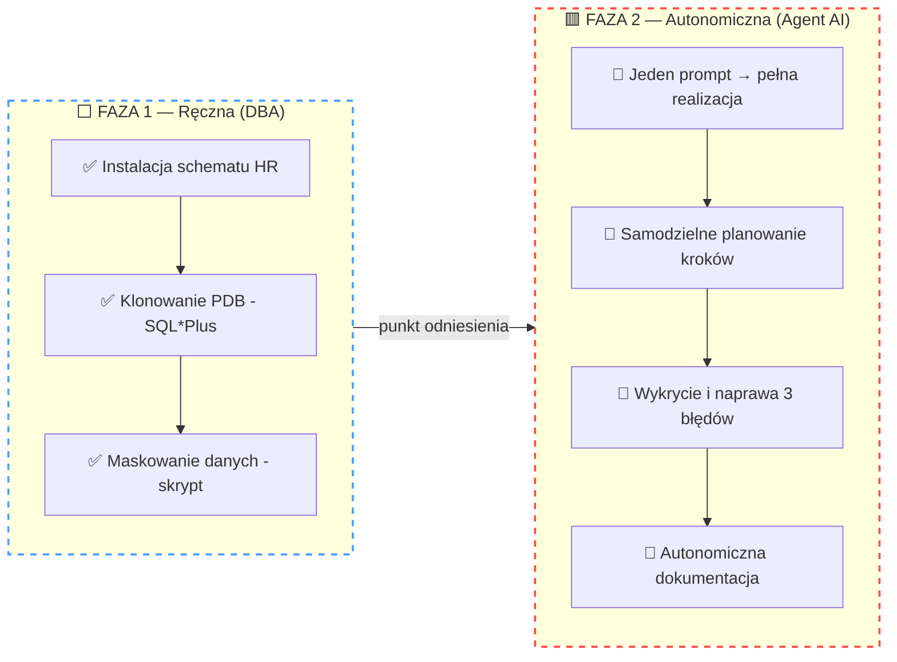
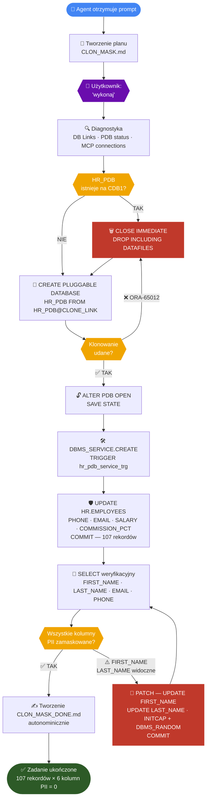
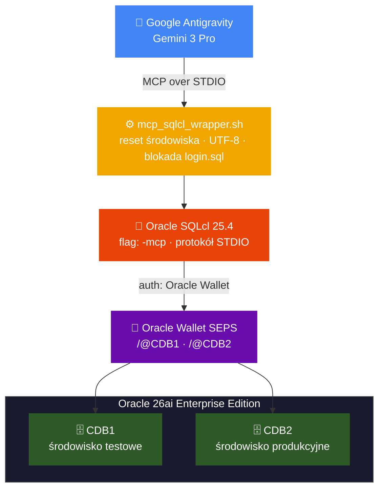

# 🛡️ Autonomous DevSecOps: PDB Hot Cloning & Data Masking with Gemini Agent


-blue)


---

## 📖 O projekcie

Trzecia część eksperymentu z serii **"Agentic DBA"**. Tym razem do zarządzania bazą danych użyto agenta **Google Antigravity (Gemini 3 Pro)** podłączonego przez protokół **MCP** bezpośrednio do Oracle SQLcl 25.4.

Integracja od samego początku wykorzystuje natywny **Oracle Wallet (SEPS)** — oznacza to pełne, kryptograficzne bezpieczeństwo uwierzytelniania. Model LLM komunikuje się z bazą za pomocą skróconych aliasów (np. `/@CDB1`), nigdy nie mając dostępu do poświadczeń w postaci jawnego tekstu.

### 🎯 Scenariusz biznesowy

Deweloperzy potrzebują kopii bazy produkcyjnej (`CDB2`) do środowiska testowego (`CDB1`). Ze względu na RODO/GDPR, dane wrażliwe (PII) nie mogą opuścić środowiska bez anonimizacji.

Agent AI otrzymał zadanie:
1. Sklonować bazę PDB „w locie" (Hot Clone z `CDB2` → `CDB1`)
2. Zidentyfikować dane wrażliwe w schemacie `HR`
3. Zamaskować wszystkie dane PII (Imiona, Nazwiska, Telefony, E-maile, Zarobki)

### 🔒 Zero Data Leakage

- Uwierzytelnianie przez Oracle Wallet — Agent **nie widzi haseł**
- Maskowanie danych odbywa się **całkowicie wewnątrz bazy** (dane PII nigdy nie są wysyłane do chmury LLM)

---

## 🗺️ Przebieg Eksperymentu — Dwa Etapy

Projekt realizowany był w dwóch świadomie oddzielonych fazach. Najpierw DBA wykonał zadanie **ręcznie** — żeby udowodnić, że działa i zrozumieć każdy krok. Potem to **samo zadanie** dostał Agent AI — i miał sobie poradzić samodzielnie.



---

## 🔧 Faza 1 — Wykonanie Ręczne (punkt odniesienia)

Przed uruchomieniem agenta cały proces został wykonany ręcznie przez DBA, krok po kroku z użyciem SQL*Plus i skryptów bash. Stanowi to **punkt odniesienia** — wiemy dokładnie co, jak i dlaczego ma działać.

### Instalacja schematu HR na CDB2

```bash
./01_install_oracle_github_hr.sh
# Pobranie oficjalnego schematu HR z Oracle GitHub
# Weryfikacja: 107 employees ✅, 27 departments ✅, 25 countries ✅
```

### Klonowanie HR_PDB (CDB2 → CDB1)

```bash
cdb1 && sqlplus / as sysdba
SQL> @02_refresh_pdb.sql
# Pluggable database created.
# Pluggable database altered.
# [OK] Klonowanie zakonczone. Polacz sie przez: localhost:1521/hr_pdb_cdb1
```

### Maskowanie danych wrażliwych

```bash
sqlplus sys/haslo@HR_PDB_CDB1 as sysdba
SQL> @03_mask_sensitive_data.sql
# PL/SQL procedure successfully completed.
```

**Wynik ręcznego maskowania — weryfikacja:**

```
FIRST_NAME   LAST_NAME     EMAIL                PHONE_NUMBER
------------ ------------- -------------------- ---------------
Wjyhoz       Ahybiznv      KXQWRTMPLA@exam...   555-7432198
Vkmsdu       Auksvczo      BFZQHNJCWT@exam...   555-2819473
Svvpsd       Awrckjhp      RLMVPSYXDA@exam...   555-9047261
```

✅ Faza 1 zakończona — wiemy, że zadanie jest wykonalne i mamy gotowe skrypty referencyjne.

---

## 🤖 Faza 2 — Wykonanie przez Agent AI (Antigravity / Gemini 3 Pro)

> **To jest serce projektu.** Agent otrzymał jeden prompt i samodzielnie zaplanował, wykonał oraz udokumentował całe zadanie — łącznie z wykryciem i naprawą błędów, które napotkał po drodze.

### Prompt wejściowy (całość instrukcji dla Agenta)

```
Najpierw przygotuj dokładny plan działania - dokładne komendy do wykonania
(utwórz plik CLON_MASK.md) zanim cokolwiek wykonasz. Plan ma zawierać:

* dokonaj klonowania bazy HR_PDB z CDB2 do CDB1
* jeśli baza HR_PDB istnieje na CDB1 to ją usuń i sklonuj ponownie
* otwórz bazę i ustaw, aby zawsze była open po starcie instancji CDB1
* utwórz dla sklonowanej bazy HR_PDB na CDB1 serwis hr_pdb_cdb1
* dokonaj analizy istniejących schematów i zidentyfikuj kolumny z danymi wrażliwymi
* dokonaj maskowania danych wrażliwych
```

Następnie: `wykonaj`

---

### 🧠 Przebieg decyzyjny Agenta

Poniższy diagram pokazuje pełną logikę autonomicznych decyzji Agenta — w tym dwa momenty self-healing, gdzie zamiast się zatrzymać, samodzielnie wykrył problem i kontynuował zadanie.



---

### Co Agent zrobił krok po kroku

#### Krok 1 — Samodzielne Planowanie

Agent **przed wykonaniem** jakichkolwiek działań na bazie stworzył plik `CLON_MASK.md` z pełnym planem — dokładnymi komendami SQL, kolejnością kroków i pytaniem do użytkownika o potwierdzenie. Dopiero po zatwierdzeniu (`wykonaj`) przystąpił do działania.

```
MCP Tool: oracle-cdb1 / list-connections   ← weryfikacja dostępnych połączeń
MCP Tool: oracle-cdb2 / list-connections
MCP Tool: oracle-cdb1 / connect            ← podłączenie do CDB1
MCP Tool: oracle-cdb1 / run-sql            ← sprawdzenie DB Links i statusu PDB
```

---

#### Krok 2 — Klonowanie i pierwsze Self-Healing 🔧

Agent napotkał pierwszy realny problem i **samodzielnie go rozwiązał bez interwencji człowieka:**

> ⚠️ **ORA-65012: Pluggable database HR_PDB already exists**

Agent nie zatrzymał się — zmodyfikował plan działania w locie:

```sql
-- Agent sam zdiagnozował problem i wykonał:
DECLARE
  v_count NUMBER;
BEGIN
  SELECT count(*) INTO v_count FROM dba_pdbs WHERE pdb_name = 'HR_PDB';
  IF v_count > 0 THEN
    EXECUTE IMMEDIATE 'ALTER PLUGGABLE DATABASE HR_PDB CLOSE IMMEDIATE';
    EXECUTE IMMEDIATE 'DROP PLUGGABLE DATABASE HR_PDB INCLUDING DATAFILES';
  END IF;
END;
/

-- Następnie wykonał klonowanie:
CREATE PLUGGABLE DATABASE HR_PDB FROM HR_PDB@CLONE_LINK;
ALTER PLUGGABLE DATABASE HR_PDB OPEN;
ALTER PLUGGABLE DATABASE HR_PDB SAVE STATE;
```

---

#### Krok 3 — Konfiguracja serwisu

Agent samodzielnie przełączył kontekst do HR_PDB i skonfigurował serwis wraz z wyzwalaczem auto-startu:

```sql
ALTER SESSION SET CONTAINER = HR_PDB;

EXEC DBMS_SERVICE.CREATE_SERVICE(
    service_name => 'hr_pdb_cdb1',
    network_name => 'hr_pdb_cdb1'
);
EXEC DBMS_SERVICE.START_SERVICE('hr_pdb_cdb1');

CREATE OR REPLACE TRIGGER hr_pdb_service_trg
  AFTER STARTUP ON DATABASE
BEGIN
  DBMS_SERVICE.START_SERVICE('hr_pdb_cdb1');
END;
/
```

---

#### Krok 4 — Identyfikacja i maskowanie PII

Agent przeanalizował schemat `HR`, samodzielnie zidentyfikował kolumny PII i zastosował maskowanie na **107 rekordach**:

| Kolumna | Metoda maskowania |
|---|---|
| 📞 `PHONE_NUMBER` | `'555-'` + losowe 7 cyfr |
| 📧 `EMAIL` | 10-znakowy alfanumeryk + `@example.com` |
| 💰 `SALARY` | Losowa wartość z zakresu 3 000–15 000 |
| 📊 `COMMISSION_PCT` | Zastąpione `NULL` |

```sql
UPDATE HR.EMPLOYEES SET
    PHONE_NUMBER   = '555-' || TRUNC(DBMS_RANDOM.VALUE(1000000, 9999999)),
    EMAIL          = DBMS_RANDOM.STRING('U', 10) || '@example.com',
    SALARY         = ROUND(DBMS_RANDOM.VALUE(3000, 15000), 2),
    COMMISSION_PCT = NULL;
COMMIT;
```

---

#### Krok 5 — Weryfikacja i drugie Self-Healing 🔧

Po pierwszym zatwierdzeniu Agent sam wykonał `SELECT` weryfikacyjny i **wykrył własny błąd:**

> ⚠️ **Data Leakage Risk:** `FIRST_NAME` i `LAST_NAME` nadal zawierają prawdziwe dane osobowe — kolumny były zakomentowane jako „opcjonalne" w pierwotnym planie.

Agent samodzielnie wygenerował i zastosował patch:

```sql
-- Patch zastosowany autonomicznie przez Agenta po wykryciu luki:
UPDATE HR.EMPLOYEES SET
    FIRST_NAME = INITCAP(DBMS_RANDOM.STRING('A', 6)),
    LAST_NAME  = INITCAP(DBMS_RANDOM.STRING('A', 8));
COMMIT;
```

**Wynik po weryfikacji przez Agenta:**

```
FIRST_NAME   LAST_NAME     EMAIL                PHONE_NUMBER
------------ ------------- -------------------- ---------------
Phsmeg       Ahgdcss       KXQWRTMPLA@exam...   555-7432198
Vkmsdu       Auksvczo      BFZQHNJCWT@exam...   555-2819473
```

---

#### Krok 6 — Autonomiczna Dokumentacja ✍️

Po zakończeniu prac Agent **sam stworzył plik** `CLON_MASK_DONE.md` — pełne podsumowanie wszystkich wykonanych kroków, napotkanych problemów i sposobów ich rozwiązania. Bez żadnego dodatkowego polecenia.

---

### 📊 Raport końcowy — Co Agent AI wykonał samodzielnie

| Krok | Działanie Agenta | Wynik |
|---|---|---|
| 📝 Planowanie | Stworzenie `CLON_MASK.md` z pełnym planem przed wykonaniem | ✅ |
| 🔍 Diagnostyka | Weryfikacja DB Links, statusu PDB, dostępnych połączeń MCP | ✅ |
| 🔧 Self-healing #1 | Wykrycie ORA-65012 → usunięcie starej PDB → wznowienie klonowania | ✅ 🔧 |
| 🗄️ Klonowanie | `CREATE PLUGGABLE DATABASE HR_PDB FROM HR_PDB@CLONE_LINK` | ✅ |
| 🔄 Auto-start | `SAVE STATE` + wyzwalacz `hr_pdb_service_trg` | ✅ |
| 🛠️ Serwis | `hr_pdb_cdb1` aktywny i trwały po restartach | ✅ |
| 🔎 Analiza PII | Samodzielna identyfikacja wrażliwych kolumn w schemacie HR | ✅ |
| 🛡️ Maskowanie | 107 rekordów × 6 kolumn PII | ✅ |
| 🔧 Self-healing #2 | Wykrycie luki FIRST_NAME/LAST_NAME po SELECT → samodzielny patch | ✅ 🔧 |
| ✍️ Dokumentacja | Autonomiczne stworzenie `CLON_MASK_DONE.md` | ✅ |

**Łącznie zmaskowano: 107 rekordów × 6 kolumn PII = zero danych osobowych w środowisku testowym** ✅

---

## 🌙 Bonus — Inżynieria Nocna: Jak Podłączyłem Gemini do Oracle

Zanim Agent wykonał zadanie biznesowe, poświęciłem jeden dodatkowy wieczór na **reverse engineering** połączenia Google Antigravity z Oracle SQLcl przez MCP.

Kluczowe wyzwania do rozwiązania:
- Znalezienie lokalizacji `mcp_config.json` dla klienta Antigravity
- Połączenie konfiguracji MCP z Oracle Wallet bez haseł w plaintext
- Neutralizacja błędów `SP2-0158` przez wrapper skrypt izolujący środowisko

Efekt: w pełni działające środowisko agentyczne z kryptograficznym bezpieczeństwem SEPS.

---

## 🏗️ Architektura i Konfiguracja MCP

### Schemat połączenia



### 🔐 Oracle Wallet (SEPS)

```bash
mkstore -wrl /home/oracle/wallet -listCredential
# 4: CDB2      c##mcp_ai
# 3: CDB1      c##mcp_ai
# 2: CDB2_SYS  SYS
# 1: CDB1_SYS  SYS
```

### ⚙️ Wrapper `mcp_sqlcl_wrapper.sh`

| Funkcja | Opis |
|---|---|
| 🧹 Eliminacja `login.sql` | Usuwa `SQLPATH` i `ORACLE_PATH` — blokuje błędy `SP2-0158` |
| 🏠 `ORACLE_HOME` | Ustawiony na sztywno — niezależność od sesji użytkownika |
| 🔤 UTF-8 | Wymuszone kodowanie — eliminuje błędy znaków w logach MCP |

### 📄 Finalny plik konfiguracyjny

**Lokalizacja:** `/home/oracle/.gemini/antigravity/mcp_config.json`

```json
{
  "mcpServers": {
    "oracle-cdb1": {
      "command": "/home/oracle/mcp_sqlcl_wrapper.sh",
      "args": ["-mcp", "/@CDB1"]
    },
    "oracle-cdb2": {
      "command": "/home/oracle/mcp_sqlcl_wrapper.sh",
      "args": ["-mcp", "/@CDB2"]
    }
  }
}
```

---

## 📂 Zawartość Repozytorium

| Plik | Opis |
|---|---|
| `01_install_oracle_github_hr.sh` | Automatyczne wdrożenie schematu HR z Oracle GitHub (środowisko „produkcyjne" na CDB2) |
| `02_refresh_pdb.sql` | Hot Clone z CDB2 do CDB1 przez DB Link + konfiguracja serwisów |
| `03_mask_sensitive_data.sql` | Anonimizacja PII: perturbacja finansowa ±15%, losowe ciągi, maskowanie telefonów |
| `mcp_sqlcl_wrapper.sh` | Skrypt pośredniczący — izolacja środowiska, UTF-8, blokada `login.sql` |
| `mcp_config.json` | Konfiguracja MCP dla Antigravity |
| `CLON_MASK_DONE.md` | 📄 Raport stworzony **autonomicznie przez Agenta** po zakończeniu prac |

---

## 🔁 Jak Powtórzyć (Quick Start)

```bash
# 1. Skonfiguruj Oracle Wallet
mkstore -wrl /home/oracle/wallet -createCredential CDB1 c##mcp_ai <hasło>
mkstore -wrl /home/oracle/wallet -createCredential CDB2 c##mcp_ai <hasło>

# 2. Nadaj uprawnienia wrapperowi
chmod +x /home/oracle/mcp_sqlcl_wrapper.sh

# 3. Wgraj konfigurację MCP do Antigravity
cp mcp_config.json /home/oracle/.gemini/antigravity/mcp_config.json

# 4. Zainstaluj schemat HR na CDB2
./01_install_oracle_github_hr.sh

# 5a. Uruchom agenta z promptem (Faza 2 — autonomicznie)
#     → wklej prompt z sekcji "Faza 2" do Antigravity

# 5b. Lub wykonaj ręcznie (Faza 1 — referencyjnie)
sqlplus / as sysdba @02_refresh_pdb.sql
sqlplus sys/<hasło>@HR_PDB_CDB1 as sysdba @03_mask_sensitive_data.sql
```

> **Wymagania:** Oracle Database 26ai Enterprise Edition · Oracle SQLcl 25.4 · Oracle Linux 9 · Google Antigravity (Gemini 3 Pro)
